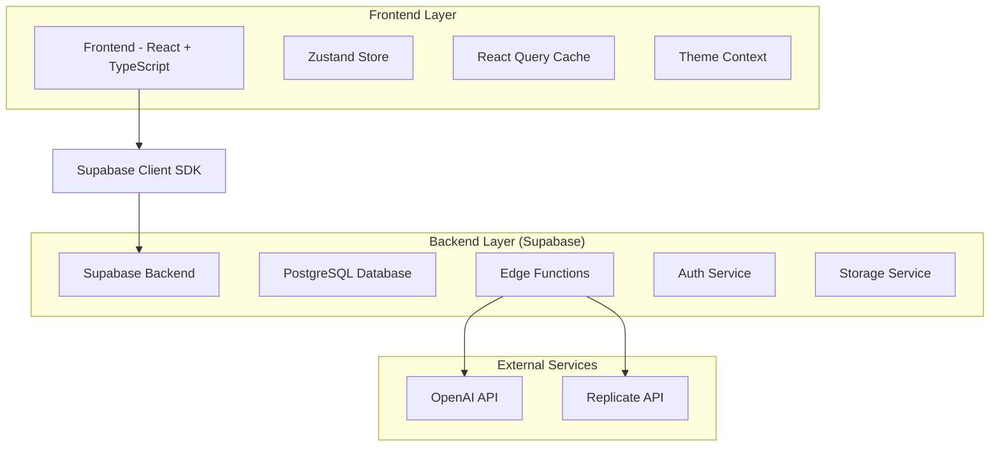
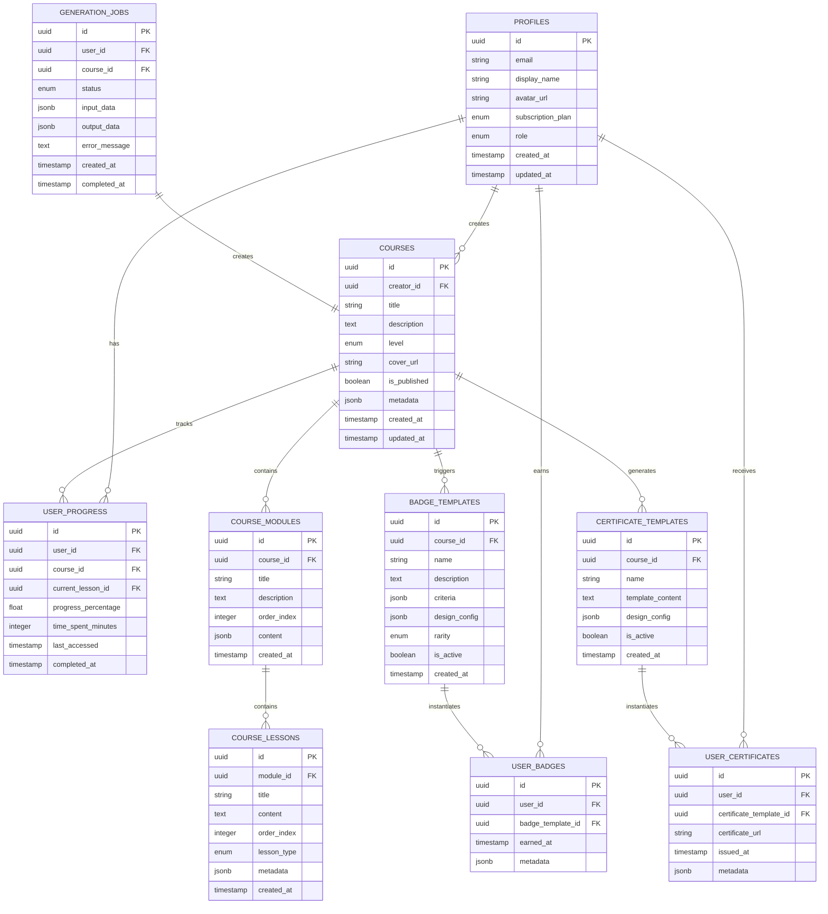

# Arquitetura Técnica - Revisão AI Squads Academy
*Especificações Técnicas e Implementação v1.0*

## 1. Arquitetura do Sistema

### 1.1 Visão Geral da Arquitetura



### 1.2 Stack Tecnológico Atual

- **Frontend**: React 18 + TypeScript + Vite
- **UI Framework**: shadcn/ui + Tailwind CSS
- **Estado Global**: Zustand
- **Cache de Dados**: React Query
- **Backend**: Supabase (PostgreSQL + Auth + Storage + Edge Functions)
- **IA**: OpenAI GPT-4 + Replicate (Flux-1.1-Pro, Recraft-V3)

---

## 2. Definições de Rotas

### 2.1 Rotas Administrativas

| Rota | Propósito | Componente |
|------|-----------|------------|
| `/admin` | Dashboard administrativo | AdminDashboard |
| `/admin/courses` | Gerenciamento de cursos | AdminCourses |
| `/admin/users` | Gerenciamento de usuários | AdminUsers |
| `/admin/badges` | Gerenciamento de badges | AdminBadges |
| `/admin/certificates` | Gerenciamento de certificados | AdminCertificates |
| `/admin/simulados` | **NOVO** - Simulados (em construção) | AdminSimulados |
| `/admin/generation/:jobId` | Acompanhamento de geração | GenerationJob |

### 2.2 Rotas do Estudante

| Rota | Propósito | Componente |
|------|-----------|------------|
| `/app` | Dashboard do estudante | AppDashboard |
| `/app/cursos` | Biblioteca de cursos | StudentCourses |
| `/app/curso/:id` | Visualização de curso | CourseView |
| `/app/missoes` | Missões e desafios | StudentMissions |
| `/app/conquistas` | Badges e conquistas | StudentAchievements |
| `/app/perfil` | Perfil do usuário | StudentProfile |
| `/app/simulados` | **NOVO** - Simulados (CTA) | SimuladosComingSoon |

---

## 3. Definições de API

### 3.1 Edge Functions (Supabase)

#### 3.1.1 Geração de Cursos

```typescript
// Edge Function: ai-generate-course
POST /functions/v1/ai-generate-course
```

**Request:**
| Parâmetro | Tipo | Obrigatório | Descrição |
|-----------|------|-------------|----------|
| title | string | true | Título do curso |
| description | string | true | Descrição do curso |
| level | enum | true | Nível: 'beginner', 'intermediate', 'advanced' |
| modules_count | number | false | Número de módulos (padrão: 5) |
| user_id | UUID | true | ID do usuário criador |

**Response:**
| Parâmetro | Tipo | Descrição |
|-----------|------|----------|
| job_id | UUID | ID do job de geração |
| status | string | Status inicial: 'pending' |
| estimated_time | number | Tempo estimado em minutos |

**Exemplo:**
```json
{
  "title": "Introdução ao JavaScript",
  "description": "Curso básico de JavaScript para iniciantes",
  "level": "beginner",
  "modules_count": 6,
  "user_id": "123e4567-e89b-12d3-a456-426614174000"
}
```

#### 3.1.2 Geração de Capas

```typescript
// Edge Function: generate-course-cover
POST /functions/v1/generate-course-cover
```

**Request:**
| Parâmetro | Tipo | Obrigatório | Descrição |
|-----------|------|-------------|----------|
| course_id | UUID | true | ID do curso |
| prompt | string | true | Prompt para geração |
| style | enum | false | Estilo: 'professional', 'creative', 'minimal' |
| model | enum | false | Modelo: 'flux', 'recraft' |

**Response:**
| Parâmetro | Tipo | Descrição |
|-----------|------|----------|
| cover_url | string | URL da capa gerada |
| generation_id | UUID | ID da geração |
| model_used | string | Modelo utilizado |

### 3.2 Operações de Banco de Dados

#### 3.2.1 Cursos

```sql
-- Buscar cursos com progresso do usuário
SELECT 
  c.*,
  COALESCE(AVG(up.progress_percentage), 0) as user_progress,
  COUNT(cm.id) as total_modules,
  COUNT(cl.id) as total_lessons
FROM courses c
LEFT JOIN course_modules cm ON c.id = cm.course_id
LEFT JOIN course_lessons cl ON cm.id = cl.module_id
LEFT JOIN user_progress up ON c.id = up.course_id AND up.user_id = $1
WHERE c.is_published = true
GROUP BY c.id
ORDER BY c.created_at DESC;
```

#### 3.2.2 Badges e Certificados

```sql
-- Verificar critérios para badges automáticos
WITH user_stats AS (
  SELECT 
    user_id,
    COUNT(DISTINCT course_id) as completed_courses,
    AVG(progress_percentage) as avg_progress,
    MAX(updated_at) as last_activity
  FROM user_progress 
  WHERE user_id = $1 AND progress_percentage = 100
  GROUP BY user_id
)
SELECT bt.*
FROM badge_templates bt
CROSS JOIN user_stats us
WHERE bt.is_active = true
  AND (
    (bt.criteria->>'type' = 'course_completion' AND us.completed_courses >= (bt.criteria->>'required_count')::int)
    OR (bt.criteria->>'type' = 'progress_average' AND us.avg_progress >= (bt.criteria->>'required_percentage')::float)
  )
  AND NOT EXISTS (
    SELECT 1 FROM user_badges ub 
    WHERE ub.user_id = $1 AND ub.badge_template_id = bt.id
  );
```

---

## 4. Modelo de Dados

### 4.1 Diagrama de Entidades



### 4.2 DDL (Data Definition Language)

#### 4.2.1 Tabelas Principais

```sql
-- Tabela de perfis (estende auth.users)
CREATE TABLE profiles (
    id UUID PRIMARY KEY REFERENCES auth.users(id) ON DELETE CASCADE,
    email VARCHAR(255) UNIQUE NOT NULL,
    display_name VARCHAR(100),
    avatar_url TEXT,
    subscription_plan VARCHAR(20) DEFAULT 'free' CHECK (subscription_plan IN ('free', 'basic', 'premium', 'enterprise')),
    role VARCHAR(20) DEFAULT 'student' CHECK (role IN ('student', 'instructor', 'admin')),
    created_at TIMESTAMP WITH TIME ZONE DEFAULT NOW(),
    updated_at TIMESTAMP WITH TIME ZONE DEFAULT NOW()
);

-- Tabela de cursos
CREATE TABLE courses (
    id UUID PRIMARY KEY DEFAULT gen_random_uuid(),
    creator_id UUID NOT NULL REFERENCES profiles(id) ON DELETE CASCADE,
    title VARCHAR(255) NOT NULL,
    description TEXT,
    level VARCHAR(20) DEFAULT 'beginner' CHECK (level IN ('beginner', 'intermediate', 'advanced')),
    cover_url TEXT,
    is_published BOOLEAN DEFAULT false,
    metadata JSONB DEFAULT '{}',
    created_at TIMESTAMP WITH TIME ZONE DEFAULT NOW(),
    updated_at TIMESTAMP WITH TIME ZONE DEFAULT NOW()
);

-- Tabela de módulos do curso
CREATE TABLE course_modules (
    id UUID PRIMARY KEY DEFAULT gen_random_uuid(),
    course_id UUID NOT NULL REFERENCES courses(id) ON DELETE CASCADE,
    title VARCHAR(255) NOT NULL,
    description TEXT,
    order_index INTEGER NOT NULL,
    content JSONB DEFAULT '{}',
    created_at TIMESTAMP WITH TIME ZONE DEFAULT NOW()
);

-- Tabela de lições
CREATE TABLE course_lessons (
    id UUID PRIMARY KEY DEFAULT gen_random_uuid(),
    module_id UUID NOT NULL REFERENCES course_modules(id) ON DELETE CASCADE,
    title VARCHAR(255) NOT NULL,
    content TEXT NOT NULL,
    order_index INTEGER NOT NULL,
    lesson_type VARCHAR(20) DEFAULT 'text' CHECK (lesson_type IN ('text', 'video', 'quiz', 'exercise')),
    metadata JSONB DEFAULT '{}',
    created_at TIMESTAMP WITH TIME ZONE DEFAULT NOW()
);

-- Tabela de progresso do usuário
CREATE TABLE user_progress (
    id UUID PRIMARY KEY DEFAULT gen_random_uuid(),
    user_id UUID NOT NULL REFERENCES profiles(id) ON DELETE CASCADE,
    course_id UUID NOT NULL REFERENCES courses(id) ON DELETE CASCADE,
    current_lesson_id UUID REFERENCES course_lessons(id),
    progress_percentage FLOAT DEFAULT 0 CHECK (progress_percentage >= 0 AND progress_percentage <= 100),
    time_spent_minutes INTEGER DEFAULT 0,
    last_accessed TIMESTAMP WITH TIME ZONE DEFAULT NOW(),
    completed_at TIMESTAMP WITH TIME ZONE,
    UNIQUE(user_id, course_id)
);

-- Tabela de templates de badges
CREATE TABLE badge_templates (
    id UUID PRIMARY KEY DEFAULT gen_random_uuid(),
    course_id UUID REFERENCES courses(id) ON DELETE CASCADE,
    name VARCHAR(255) NOT NULL,
    description TEXT,
    criteria JSONB NOT NULL DEFAULT '{}',
    design_config JSONB DEFAULT '{}',
    rarity VARCHAR(20) DEFAULT 'bronze' CHECK (rarity IN ('bronze', 'silver', 'gold', 'platinum')),
    is_active BOOLEAN DEFAULT true,
    created_at TIMESTAMP WITH TIME ZONE DEFAULT NOW()
);

-- Tabela de badges do usuário
CREATE TABLE user_badges (
    id UUID PRIMARY KEY DEFAULT gen_random_uuid(),
    user_id UUID NOT NULL REFERENCES profiles(id) ON DELETE CASCADE,
    badge_template_id UUID NOT NULL REFERENCES badge_templates(id) ON DELETE CASCADE,
    earned_at TIMESTAMP WITH TIME ZONE DEFAULT NOW(),
    metadata JSONB DEFAULT '{}',
    UNIQUE(user_id, badge_template_id)
);

-- Tabela de jobs de geração
CREATE TABLE generation_jobs (
    id UUID PRIMARY KEY DEFAULT gen_random_uuid(),
    user_id UUID NOT NULL REFERENCES profiles(id) ON DELETE CASCADE,
    course_id UUID REFERENCES courses(id) ON DELETE SET NULL,
    status VARCHAR(20) DEFAULT 'pending' CHECK (status IN ('pending', 'processing', 'completed', 'failed')),
    input_data JSONB NOT NULL DEFAULT '{}',
    output_data JSONB DEFAULT '{}',
    error_message TEXT,
    created_at TIMESTAMP WITH TIME ZONE DEFAULT NOW(),
    completed_at TIMESTAMP WITH TIME ZONE
);
```

#### 4.2.2 Índices para Performance

```sql
-- Índices para otimização de consultas
CREATE INDEX idx_courses_creator_published ON courses(creator_id, is_published);
CREATE INDEX idx_courses_level_published ON courses(level, is_published);
CREATE INDEX idx_course_modules_course_order ON course_modules(course_id, order_index);
CREATE INDEX idx_course_lessons_module_order ON course_lessons(module_id, order_index);
CREATE INDEX idx_user_progress_user_course ON user_progress(user_id, course_id);
CREATE INDEX idx_user_progress_course_percentage ON user_progress(course_id, progress_percentage DESC);
CREATE INDEX idx_user_badges_user_earned ON user_badges(user_id, earned_at DESC);
CREATE INDEX idx_badge_templates_course_active ON badge_templates(course_id, is_active);
CREATE INDEX idx_generation_jobs_user_status ON generation_jobs(user_id, status);
CREATE INDEX idx_generation_jobs_status_created ON generation_jobs(status, created_at DESC);

-- Índices para busca de texto
CREATE INDEX idx_courses_title_search ON courses USING gin(to_tsvector('portuguese', title));
CREATE INDEX idx_courses_description_search ON courses USING gin(to_tsvector('portuguese', description));
```

#### 4.2.3 Políticas RLS (Row Level Security)

```sql
-- Habilitar RLS nas tabelas
ALTER TABLE profiles ENABLE ROW LEVEL SECURITY;
ALTER TABLE courses ENABLE ROW LEVEL SECURITY;
ALTER TABLE course_modules ENABLE ROW LEVEL SECURITY;
ALTER TABLE course_lessons ENABLE ROW LEVEL SECURITY;
ALTER TABLE user_progress ENABLE ROW LEVEL SECURITY;
ALTER TABLE badge_templates ENABLE ROW LEVEL SECURITY;
ALTER TABLE user_badges ENABLE ROW LEVEL SECURITY;
ALTER TABLE generation_jobs ENABLE ROW LEVEL SECURITY;

-- Políticas para profiles
CREATE POLICY profiles_select_own ON profiles
    FOR SELECT USING (auth.uid() = id);

CREATE POLICY profiles_update_own ON profiles
    FOR UPDATE USING (auth.uid() = id);

-- Políticas para cursos
CREATE POLICY courses_select_published ON courses
    FOR SELECT USING (is_published = true OR creator_id = auth.uid());

CREATE POLICY courses_insert_own ON courses
    FOR INSERT WITH CHECK (creator_id = auth.uid());

CREATE POLICY courses_update_own ON courses
    FOR UPDATE USING (creator_id = auth.uid());

-- Políticas para progresso do usuário
CREATE POLICY user_progress_own ON user_progress
    FOR ALL USING (user_id = auth.uid());

-- Políticas para badges do usuário
CREATE POLICY user_badges_own ON user_badges
    FOR ALL USING (user_id = auth.uid());

-- Políticas para jobs de geração
CREATE POLICY generation_jobs_own ON generation_jobs
    FOR ALL USING (user_id = auth.uid());
```

#### 4.2.4 Triggers e Funções

```sql
-- Função para atualizar timestamp
CREATE OR REPLACE FUNCTION update_updated_at_column()
RETURNS TRIGGER AS $$
BEGIN
    NEW.updated_at = NOW();
    RETURN NEW;
END;
$$ language 'plpgsql';

-- Trigger para atualizar updated_at
CREATE TRIGGER update_profiles_updated_at
    BEFORE UPDATE ON profiles
    FOR EACH ROW
    EXECUTE FUNCTION update_updated_at_column();

CREATE TRIGGER update_courses_updated_at
    BEFORE UPDATE ON courses
    FOR EACH ROW
    EXECUTE FUNCTION update_updated_at_column();

-- Função para verificar badges automáticos
CREATE OR REPLACE FUNCTION check_automatic_badges()
RETURNS TRIGGER AS $$
DECLARE
    badge_record RECORD;
BEGIN
    -- Verificar badges baseados em conclusão de curso
    IF NEW.progress_percentage = 100 AND (OLD.progress_percentage IS NULL OR OLD.progress_percentage < 100) THEN
        FOR badge_record IN
            SELECT bt.*
            FROM badge_templates bt
            WHERE bt.course_id = NEW.course_id
              AND bt.is_active = true
              AND bt.criteria->>'type' = 'course_completion'
              AND NOT EXISTS (
                  SELECT 1 FROM user_badges ub
                  WHERE ub.user_id = NEW.user_id AND ub.badge_template_id = bt.id
              )
        LOOP
            INSERT INTO user_badges (user_id, badge_template_id, earned_at)
            VALUES (NEW.user_id, badge_record.id, NOW());
        END LOOP;
    END IF;
    
    RETURN NEW;
END;
$$ language 'plpgsql';

-- Trigger para badges automáticos
CREATE TRIGGER trigger_check_automatic_badges
    AFTER INSERT OR UPDATE ON user_progress
    FOR EACH ROW
    EXECUTE FUNCTION check_automatic_badges();
```

---

## 5. Sistema de Temas

### 5.1 Estrutura do Theme Context

```typescript
// src/contexts/theme-context.tsx
interface ThemeColors {
  // Cores primárias
  primary: string;
  primaryForeground: string;
  primaryBg: string;
  primaryText: string;
  primaryHover: string;
  
  // Cores de fundo
  background: string;
  foreground: string;
  
  // Componentes
  card: string;
  cardForeground: string;
  
  // Estados
  muted: string;
  mutedForeground: string;
  
  // Bordas e acentos
  border: string;
  accent: string;
  accentForeground: string;
  
  // Destrutivos
  destructive: string;
  destructiveForeground: string;
}

interface ThemeContextType {
  theme: 'light' | 'dark';
  toggleTheme: () => void;
  getThemeColors: () => ThemeColors;
}

const lightTheme: ThemeColors = {
  primary: 'text-orange-600',
  primaryForeground: 'text-white',
  primaryBg: 'bg-orange-600',
  primaryText: 'text-orange-600',
  primaryHover: 'hover:bg-orange-700',
  
  background: 'bg-white',
  foreground: 'text-gray-900',
  
  card: 'bg-white',
  cardForeground: 'text-gray-900',
  
  muted: 'bg-gray-100',
  mutedForeground: 'text-gray-600',
  
  border: 'border-gray-200',
  accent: 'bg-gray-100',
  accentForeground: 'text-gray-900',
  
  destructive: 'bg-red-500',
  destructiveForeground: 'text-white'
};

const darkTheme: ThemeColors = {
  primary: 'text-orange-400',
  primaryForeground: 'text-gray-900',
  primaryBg: 'bg-orange-600',
  primaryText: 'text-orange-400',
  primaryHover: 'hover:bg-orange-500',
  
  background: 'bg-gray-900',
  foreground: 'text-gray-100',
  
  card: 'bg-gray-800',
  cardForeground: 'text-gray-100',
  
  muted: 'bg-gray-800',
  mutedForeground: 'text-gray-400',
  
  border: 'border-gray-700',
  accent: 'bg-gray-800',
  accentForeground: 'text-gray-100',
  
  destructive: 'bg-red-600',
  destructiveForeground: 'text-white'
};
```

### 5.2 Implementação de Componentes Temáticos

```typescript
// Exemplo de componente com tema
import { useTheme } from '@/contexts/theme-context';

interface ThemedCardProps {
  title: string;
  children: React.ReactNode;
  className?: string;
}

export function ThemedCard({ title, children, className = '' }: ThemedCardProps) {
  const { getThemeColors } = useTheme();
  const themeColors = getThemeColors();
  
  return (
    <div className={`
      ${themeColors.card} 
      ${themeColors.border} 
      border rounded-lg p-6 
      transition-colors duration-200
      ${className}
    `}>
      <h3 className={`
        text-lg font-semibold mb-4 
        ${themeColors.cardForeground}
      `}>
        {title}
      </h3>
      <div className={themeColors.cardForeground}>
        {children}
      </div>
    </div>
  );
}
```

---

## 6. Sistema de Badges e Certificados

### 6.1 Tipos de Badges

```typescript
// Tipos de critérios para badges
interface BadgeCriteria {
  type: 'course_completion' | 'progress_average' | 'time_spent' | 'streak_days' | 'custom';
  required_count?: number;
  required_percentage?: number;
  required_minutes?: number;
  required_days?: number;
  custom_logic?: string;
}

// Configuração de design
interface BadgeDesign {
  backgroundColor: string;
  textColor: string;
  icon: string;
  borderStyle: 'solid' | 'dashed' | 'dotted';
  borderColor?: string;
  gradient?: {
    from: string;
    to: string;
  };
}

// Template completo de badge
interface BadgeTemplate {
  id: string;
  course_id?: string;
  name: string;
  description: string;
  criteria: BadgeCriteria;
  design_config: BadgeDesign;
  rarity: 'bronze' | 'silver' | 'gold' | 'platinum';
  is_active: boolean;
  created_at: string;
}
```

### 6.2 Sistema de Verificação Automática

```typescript
// Hook para verificação de badges
export function useAutomaticBadges(userId: string) {
  const checkBadges = useCallback(async () => {
    const { data: eligibleBadges } = await supabase
      .rpc('check_eligible_badges', { user_id: userId });
    
    for (const badge of eligibleBadges || []) {
      await awardBadge(userId, badge.id);
    }
  }, [userId]);
  
  const awardBadge = async (userId: string, badgeTemplateId: string) => {
    const { error } = await supabase
      .from('user_badges')
      .insert({
        user_id: userId,
        badge_template_id: badgeTemplateId,
        earned_at: new Date().toISOString()
      });
    
    if (!error) {
      // Notificar usuário
      toast.success('Novo badge conquistado!');
    }
  };
  
  return { checkBadges };
}
```

---

## 7. Otimizações de Performance

### 7.1 Lazy Loading de Componentes

```typescript
// Lazy loading para páginas
const AdminDashboard = lazy(() => import('@/pages/admin/AdminDashboard'));
const StudentCourses = lazy(() => import('@/pages/app/StudentCourses'));
const CourseView = lazy(() => import('@/pages/app/CourseView'));

// Wrapper com Suspense
function LazyRoute({ children }: { children: React.ReactNode }) {
  return (
    <Suspense fallback={
      <div className="flex items-center justify-center min-h-[400px]">
        <div className="animate-spin rounded-full h-8 w-8 border-b-2 border-orange-600"></div>
      </div>
    }>
      {children}
    </Suspense>
  );
}
```

### 7.2 Cache de Dados com React Query

```typescript
// Configuração de cache otimizada
const queryClient = new QueryClient({
  defaultOptions: {
    queries: {
      staleTime: 5 * 60 * 1000, // 5 minutos
      cacheTime: 10 * 60 * 1000, // 10 minutos
      retry: 2,
      refetchOnWindowFocus: false,
    },
  },
});

// Hook otimizado para cursos
export function useCourses() {
  return useQuery({
    queryKey: ['courses'],
    queryFn: async () => {
      const { data, error } = await supabase
        .from('courses')
        .select(`
          *,
          course_modules(count),
          user_progress(progress_percentage)
        `)
        .eq('is_published', true)
        .order('created_at', { ascending: false });
      
      if (error) throw error;
      return data;
    },
    staleTime: 2 * 60 * 1000, // 2 minutos para dados dinâmicos
  });
}
```

### 7.3 Otimização de Bundle

```typescript
// vite.config.ts - Configuração de build otimizada
export default defineConfig({
  build: {
    rollupOptions: {
      output: {
        manualChunks: {
          vendor: ['react', 'react-dom'],
          ui: ['@radix-ui/react-dialog', '@radix-ui/react-dropdown-menu'],
          supabase: ['@supabase/supabase-js'],
          utils: ['date-fns', 'clsx', 'tailwind-merge']
        }
      }
    },
    chunkSizeWarningLimit: 1000
  },
  optimizeDeps: {
    include: ['react', 'react-dom', '@supabase/supabase-js']
  }
});
```

---

## 8. Monitoramento e Logs

### 8.1 Sistema de Logs

```typescript
// Utilitário de logging
interface LogEntry {
  level: 'info' | 'warn' | 'error' | 'debug';
  message: string;
  context?: Record<string, any>;
  timestamp: string;
  userId?: string;
}

class Logger {
  private static instance: Logger;
  
  static getInstance(): Logger {
    if (!Logger.instance) {
      Logger.instance = new Logger();
    }
    return Logger.instance;
  }
  
  async log(entry: Omit<LogEntry, 'timestamp'>) {
    const logEntry: LogEntry = {
      ...entry,
      timestamp: new Date().toISOString()
    };
    
    // Log local
    console.log(`[${logEntry.level.toUpperCase()}] ${logEntry.message}`, logEntry.context);
    
    // Log remoto (apenas para erros em produção)
    if (entry.level === 'error' && import.meta.env.PROD) {
      await this.sendToRemoteLog(logEntry);
    }
  }
  
  private async sendToRemoteLog(entry: LogEntry) {
    try {
      await supabase.from('application_logs').insert(entry);
    } catch (error) {
      console.error('Failed to send log to remote:', error);
    }
  }
}

export const logger = Logger.getInstance();
```

### 8.2 Métricas de Performance

```typescript
// Hook para métricas de performance
export function usePerformanceMetrics() {
  const [metrics, setMetrics] = useState({
    pageLoadTime: 0,
    apiResponseTime: 0,
    renderTime: 0
  });
  
  useEffect(() => {
    // Medir tempo de carregamento da página
    const navigationEntry = performance.getEntriesByType('navigation')[0] as PerformanceNavigationTiming;
    if (navigationEntry) {
      setMetrics(prev => ({
        ...prev,
        pageLoadTime: navigationEntry.loadEventEnd - navigationEntry.loadEventStart
      }));
    }
    
    // Medir tempo de renderização
    const observer = new PerformanceObserver((list) => {
      const entries = list.getEntries();
      entries.forEach((entry) => {
        if (entry.entryType === 'measure') {
          setMetrics(prev => ({
            ...prev,
            renderTime: entry.duration
          }));
        }
      });
    });
    
    observer.observe({ entryTypes: ['measure'] });
    
    return () => observer.disconnect();
  }, []);
  
  return metrics;
}
```

---

## 9. Testes e Qualidade

### 9.1 Estrutura de Testes

```typescript
// Teste de componente
import { render, screen, fireEvent } from '@testing-library/react';
import { QueryClient, QueryClientProvider } from '@tanstack/react-query';
import { ThemeProvider } from '@/contexts/theme-context';
import { CourseCard } from '@/components/courses/CourseCard';

const createTestWrapper = () => {
  const queryClient = new QueryClient({
    defaultOptions: {
      queries: { retry: false },
      mutations: { retry: false },
    },
  });
  
  return ({ children }: { children: React.ReactNode }) => (
    <QueryClientProvider client={queryClient}>
      <ThemeProvider>
        {children}
      </ThemeProvider>
    </QueryClientProvider>
  );
};

describe('CourseCard', () => {
  const mockCourse = {
    id: '1',
    title: 'Curso de Teste',
    description: 'Descrição do curso de teste',
    level: 'beginner' as const,
    cover_url: 'https://example.com/cover.jpg',
    is_published: true,
    created_at: '2024-01-01T00:00:00Z'
  };
  
  it('deve renderizar informações do curso corretamente', () => {
    render(<CourseCard course={mockCourse} />, {
      wrapper: createTestWrapper()
    });
    
    expect(screen.getByText('Curso de Teste')).toBeInTheDocument();
    expect(screen.getByText('Descrição do curso de teste')).toBeInTheDocument();
    expect(screen.getByText('Iniciante')).toBeInTheDocument();
  });
  
  it('deve navegar para o curso ao clicar', () => {
    const mockNavigate = jest.fn();
    jest.mock('react-router-dom', () => ({
      ...jest.requireActual('react-router-dom'),
      useNavigate: () => mockNavigate
    }));
    
    render(<CourseCard course={mockCourse} />, {
      wrapper: createTestWrapper()
    });
    
    fireEvent.click(screen.getByRole('button'));
    expect(mockNavigate).toHaveBeenCalledWith('/app/curso/1');
  });
});
```

### 9.2 Testes de Integração

```typescript
// Teste de fluxo completo
describe('Fluxo de Geração de Curso', () => {
  it('deve gerar curso completo com sucesso', async () => {
    // Mock da API
    const mockSupabase = {
      functions: {
        invoke: jest.fn().mockResolvedValue({
          data: { job_id: 'test-job-id' },
          error: null
        })
      }
    };
    
    // Renderizar componente
    render(<CourseGenerator />, {
      wrapper: createTestWrapper()
    });
    
    // Preencher formulário
    fireEvent.change(screen.getByLabelText('Título do Curso'), {
      target: { value: 'Curso de Teste' }
    });
    
    fireEvent.change(screen.getByLabelText('Descrição'), {
      target: { value: 'Descrição do curso de teste' }
    });
    
    // Submeter formulário
    fireEvent.click(screen.getByText('Gerar Curso'));
    
    // Verificar chamada da API
    await waitFor(() => {
      expect(mockSupabase.functions.invoke).toHaveBeenCalledWith(
        'ai-generate-course',
        {
          body: {
            title: 'Curso de Teste',
            description: 'Descrição do curso de teste',
            level: 'beginner',
            modules_count: 5
          }
        }
      );
    });
    
    // Verificar redirecionamento
    expect(screen.getByText('Gerando curso...')).toBeInTheDocument();
  });
});
```

---

## 10. Deploy e DevOps

### 10.1 Configuração de Deploy

```yaml
# .github/workflows/deploy.yml
name: Deploy to Production

on:
  push:
    branches: [main]

jobs:
  deploy:
    runs-on: ubuntu-latest
    
    steps:
    - uses: actions/checkout@v3
    
    - name: Setup Node.js
      uses: actions/setup-node@v3
      with:
        node-version: '18'
        cache: 'npm'
    
    - name: Install dependencies
      run: npm ci
    
    - name: Run tests
      run: npm run test
    
    - name: Build application
      run: npm run build
      env:
        VITE_SUPABASE_URL: ${{ secrets.VITE_SUPABASE_URL }}
        VITE_SUPABASE_ANON_KEY: ${{ secrets.VITE_SUPABASE_ANON_KEY }}
    
    - name: Deploy to Vercel
      uses: vercel/action@v1
      with:
        vercel-token: ${{ secrets.VERCEL_TOKEN }}
        vercel-org-id: ${{ secrets.VERCEL_ORG_ID }}
        vercel-project-id: ${{ secrets.VERCEL_PROJECT_ID }}
        vercel-args: '--prod'
```

### 10.2 Variáveis de Ambiente

```bash
# .env.example
# Supabase Configuration
VITE_SUPABASE_URL=your_supabase_project_url
VITE_SUPABASE_ANON_KEY=your_supabase_anon_key

# OpenAI Configuration
OPENAI_API_KEY=your_openai_api_key

# Replicate Configuration
REPLICATE_API_TOKEN=your_replicate_api_token

# Application Configuration
VITE_APP_URL=http://localhost:5173
VITE_APP_NAME="AI Squads Academy"

# Development
VITE_DEV_MODE=true
VITE_ENABLE_LOGS=true
```

---

*Documento criado em: {{data_atual}}*
*Versão: 1.0*
*Responsável: Arquiteto de Software AI Squads Academy*