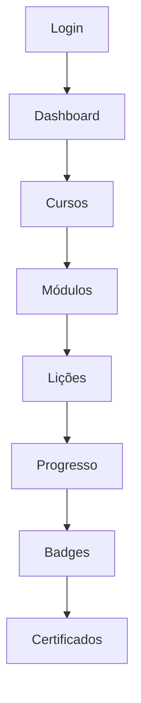

# Plano de Revisão Completa - AI Squads Academy
*Análise e Estratégia de Otimização v1.0*

## 📋 Resumo Executivo

Este documento apresenta um plano abrangente para revisão, correção e otimização do projeto AI Squads Academy. A análise identifica 7 áreas críticas que necessitam intervenção para garantir estabilidade, performance e experiência de usuário consistente.

## 🎯 Objetivos Principais

- **Estabilidade**: Garantir funcionamento robusto de todas as funcionalidades
- **Performance**: Otimizar carregamento e responsividade
- **Consistência**: Padronizar temas e experiência visual
- **Segurança**: Implementar medidas preventivas e backup
- **Documentação**: Criar documentação completa e atualizada

---

## 1. 🔍 Análise da Pasta Tactical-Command-Interface

### 1.1 Situação Atual
**Localização**: `c:\Users\cleyt\Documents\git1\ai-squads-academy\src\tactical-command-interface`

### 1.2 Análise de Dependências

#### ✅ Componentes Migrados com Sucesso
- **TacticalActivityCard**: Migrado para `src/components/tactical/`
- **TacticalStatsCard**: Migrado para `src/components/tactical/`
- **TacticalChart**: Migrado para `src/components/tactical/`
- **TacticalSidebar**: Migrado para `src/components/`

#### ⚠️ Componentes Duplicados Identificados
- `command.tsx`: Existe em ambas as pastas
- Documentação de banco: README.md duplicado

### 1.3 Recomendação
**SEGURO PARA REMOÇÃO** após validação final:

1. **Verificar imports**: Confirmar que nenhum arquivo ativo importa da pasta
2. **Backup preventivo**: Criar backup da pasta antes da remoção
3. **Teste de funcionalidade**: Validar que o dashboard do aluno funciona completamente
4. **Remoção gradual**: Remover arquivos em lotes pequenos com testes intermediários

---

## 2. 🚀 Validação do Sistema de Geração de Cursos

### 2.1 Componentes a Validar

#### 2.1.1 Geração de Conteúdo
- **Edge Function**: `ai-generate-course`
- **Progresso em tempo real**: Tabela `generation_jobs.output`
- **Página de acompanhamento**: `/admin/generation/:jobId`

#### 2.1.2 Persistência de Dados
```sql
-- Tabelas críticas para validação
COURSES
COURSE_MODULES
COURSE_LESSONS
GENERATION_JOBS
```

### 2.2 Testes Necessários

#### ✅ Checklist de Validação
- [ ] Geração completa de curso (início ao fim)
- [ ] Persistência de módulos e lições
- [ ] Integridade referencial entre tabelas
- [ ] Tratamento de erros na geração
- [ ] Recuperação de jobs interrompidos
- [ ] Publicação para estudantes
- [ ] Visualização no painel do aluno

### 2.3 Métricas de Sucesso
- **Tempo de geração**: < 5 minutos para curso padrão
- **Taxa de sucesso**: > 95%
- **Integridade de dados**: 100%
- **Disponibilidade para alunos**: Imediata após publicação

---

## 3. 🎨 Padronização de Temas Claro e Escuro

### 3.1 Problemas Identificados

#### 3.1.1 Inconsistências Visuais
- Componentes com cores hardcoded
- Transições de tema incompletas
- Contraste inadequado em alguns elementos
- Ícones não adaptados ao tema

#### 3.1.2 Componentes Críticos
```typescript
// Componentes que necessitam revisão
- AppDashboard.tsx
- TacticalSidebar.tsx
- AdminDashboard
- StudentCourses
- BadgeManagement
```

### 3.2 Estratégia de Padronização

#### 3.2.1 Sistema de Cores Unificado
```typescript
// Estrutura proposta para theme-context
interface ThemeColors {
  // Cores primárias
  primary: string;
  primaryForeground: string;
  
  // Cores de fundo
  background: string;
  foreground: string;
  
  // Componentes
  card: string;
  cardForeground: string;
  
  // Estados
  muted: string;
  mutedForeground: string;
  
  // Bordas e acentos
  border: string;
  accent: string;
  accentForeground: string;
}
```

#### 3.2.2 Implementação
1. **Auditoria completa**: Identificar todos os elementos com cores fixas
2. **Refatoração gradual**: Migrar componente por componente
3. **Testes de acessibilidade**: Validar contraste WCAG AA
4. **Documentação**: Criar guia de uso do sistema de temas

### 3.3 Checklist de Acessibilidade
- [ ] Contraste mínimo 4.5:1 para texto normal
- [ ] Contraste mínimo 3:1 para texto grande
- [ ] Indicadores visuais além de cor
- [ ] Navegação por teclado funcional
- [ ] Leitores de tela compatíveis

---

## 4. 🏆 Validação do Sistema de Certificados e Badges

### 4.1 Estrutura Atual

#### 4.1.1 Tabelas do Sistema
```sql
-- Estrutura de badges
BADGE_TEMPLATES
USER_BADGES
CERTIFICATE_TEMPLATES
USER_CERTIFICATES
```

#### 4.1.2 Fluxo de Geração
1. **Trigger**: Conclusão de curso/módulo
2. **Validação**: Verificar critérios de conquista
3. **Geração**: Criar badge/certificado
4. **Notificação**: Informar usuário
5. **Armazenamento**: Persistir no banco

### 4.2 Testes de Validação

#### ✅ Cenários de Teste
- [ ] Conclusão de curso completo
- [ ] Conclusão de módulo individual
- [ ] Badges por tempo de estudo
- [ ] Badges por sequência de dias
- [ ] Certificados personalizados
- [ ] Download de certificados
- [ ] Compartilhamento social

### 4.3 Melhorias Propostas

#### 4.3.1 Sistema de Templates
```typescript
// Estrutura aprimorada para templates
interface BadgeTemplate {
  id: string;
  name: string;
  description: string;
  criteria: BadgeCriteria;
  design: BadgeDesign;
  rarity: 'bronze' | 'silver' | 'gold' | 'platinum';
  isActive: boolean;
}
```

#### 4.3.2 Automação
- **Triggers automáticos**: Baseados em eventos do sistema
- **Validação em tempo real**: Verificação contínua de critérios
- **Cache inteligente**: Otimizar consultas de badges

---

## 5. 🗄️ Otimização do Esquema do Banco de Dados

### 5.1 Análise da Estrutura Atual

#### 5.1.1 Tabelas Principais
```sql
-- Estrutura atual identificada
PROFILES
COURSES
COURSE_MODULES
COURSE_LESSONS
USER_PROGRESS
USER_BADGES
USER_CERTIFICATES
GENERATION_JOBS
BADGE_TEMPLATES
CERTIFICATE_TEMPLATES
```

#### 5.1.2 Problemas Identificados
- **Consultas N+1**: Em listagens de cursos
- **Índices ausentes**: Em campos de busca frequente
- **Dados desnormalizados**: Informações duplicadas
- **Triggers ineficientes**: Lógica complexa em triggers

### 5.2 Estratégia de Otimização

#### 5.2.1 Índices Propostos
```sql
-- Índices para performance
CREATE INDEX idx_user_progress_user_course ON user_progress(user_id, course_id);
CREATE INDEX idx_course_modules_course_order ON course_modules(course_id, order_index);
CREATE INDEX idx_user_badges_user_earned ON user_badges(user_id, earned_at DESC);
CREATE INDEX idx_generation_jobs_status_created ON generation_jobs(status, created_at DESC);
```

#### 5.2.2 Normalização
- **Separar metadados**: Criar tabelas específicas para configurações
- **Otimizar JSON**: Usar campos estruturados quando possível
- **Cache de agregações**: Tabelas de estatísticas pré-calculadas

#### 5.2.3 Políticas RLS (Row Level Security)
```sql
-- Segurança por linha
ALTER TABLE user_progress ENABLE ROW LEVEL SECURITY;
CREATE POLICY user_progress_policy ON user_progress
  FOR ALL USING (auth.uid() = user_id);
```

### 5.3 Monitoramento e Métricas
- **Query performance**: Tempo médio < 100ms
- **Índice de uso**: Monitorar índices não utilizados
- **Crescimento de dados**: Projeção de escalabilidade

---

## 6. 📚 Documentação Completa do Projeto

### 6.1 Estrutura de Documentação

#### 6.1.1 Documentos Técnicos
```
docs/
├── README.md                 # Visão geral do projeto
├── INSTALLATION.md          # Guia de instalação
├── ARCHITECTURE.md          # Arquitetura do sistema
├── API_REFERENCE.md         # Documentação da API
├── DATABASE_SCHEMA.md       # Esquema do banco
├── DEPLOYMENT.md            # Guia de deploy
├── TROUBLESHOOTING.md       # Solução de problemas
└── CHANGELOG.md             # Histórico de mudanças
```

#### 6.1.2 Documentos de Usuário
```
docs/user/
├── ADMIN_GUIDE.md           # Guia do administrador
├── INSTRUCTOR_GUIDE.md      # Guia do instrutor
├── STUDENT_GUIDE.md         # Guia do estudante
└── FAQ.md                   # Perguntas frequentes
```

### 6.2 Conteúdo Essencial

#### 6.2.1 Objetivos e Funcionalidades
- **Visão do produto**: Plataforma de ensino com IA
- **Público-alvo**: Educadores e estudantes
- **Funcionalidades principais**: Geração de cursos, badges, certificados
- **Diferenciais**: IA para criação de conteúdo

#### 6.2.2 Arquitetura Técnica
- **Stack tecnológico**: React + TypeScript + Vite + Supabase
- **Padrões de código**: ESLint + Prettier + Husky
- **Estrutura de pastas**: Organização modular
- **Fluxo de dados**: Estado global com Zustand

#### 6.2.3 Guias de Uso
- **Instalação local**: Passo a passo completo
- **Configuração**: Variáveis de ambiente
- **Deploy**: Processo de publicação
- **Manutenção**: Rotinas de backup e monitoramento

### 6.3 Ferramentas de Documentação
- **JSDoc**: Documentação inline do código
- **Storybook**: Documentação de componentes
- **OpenAPI**: Especificação da API
- **Mermaid**: Diagramas de arquitetura

---

## 7. 🧪 Implementação da Aba Simulados

### 7.1 Requisitos Funcionais

#### 7.1.1 Painel Administrativo
- **Localização**: Navbar do admin
- **Funcionalidade**: Página "Em Construção"
- **Design**: Consistente com framework existente
- **Permissões**: Apenas administradores

#### 7.1.2 Painel do Estudante
- **Localização**: Navbar do estudante
- **Funcionalidade**: CTA atrativo para futura funcionalidade
- **Design**: Integrado ao tema tactical
- **Comportamento**: Modal informativo ou página teaser

### 7.2 Implementação Técnica

#### 7.2.1 Estrutura de Arquivos
```typescript
// Novos arquivos necessários
src/pages/admin/AdminSimulados.tsx
src/pages/app/Simulados.tsx
src/components/simulados/SimuladosComingSoon.tsx
```

#### 7.2.2 Rotas
```typescript
// Adições ao router
{
  path: '/admin/simulados',
  element: <AdminSimulados />,
  meta: { requiresAuth: true, role: 'admin' }
},
{
  path: '/app/simulados',
  element: <Simulados />,
  meta: { requiresAuth: true }
}
```

#### 7.2.3 Navbar Updates
```typescript
// AdminSidebar.tsx
const adminNavItems = [
  // ... existing items
  {
    id: 'simulados',
    label: 'SIMULADOS',
    icon: FileText,
    path: '/admin/simulados',
    description: 'Gerenciar simulados e avaliações'
  }
];

// TacticalSidebar.tsx
const studentNavItems = [
  // ... existing items
  {
    id: 'simulados',
    label: 'SIMULADOS',
    icon: FileText,
    path: '/app/simulados',
    description: 'Testes e avaliações',
    badge: 'EM BREVE'
  }
];
```

### 7.3 Design e UX

#### 7.3.1 Página "Em Construção" (Admin)
```typescript
// Componente AdminSimulados
- Header com título e descrição
- Ícone de construção
- Roadmap de funcionalidades planejadas
- Data estimada de lançamento
- Botão para feedback/sugestões
```

#### 7.3.2 CTA Atrativo (Estudante)
```typescript
// Componente Simulados
- Design tactical/militar consistente
- Animações sutis
- Preview das funcionalidades
- Formulário de interesse
- Notificação de lançamento
```

---

## 🛡️ Medidas de Segurança Obrigatórias

### 8.1 Backup e Versionamento

#### 8.1.1 Estratégia de Backup
```bash
# Script de backup automático
#!/bin/bash
DATE=$(date +%Y%m%d_%H%M%S)
BACKUP_DIR="backup_${DATE}"

# Backup do código
cp -r src/ "${BACKUP_DIR}/src/"
cp -r public/ "${BACKUP_DIR}/public/"
cp package.json "${BACKUP_DIR}/"
cp *.config.* "${BACKUP_DIR}/"

# Backup do banco (Supabase)
supabase db dump > "${BACKUP_DIR}/database_dump.sql"

echo "Backup criado em: ${BACKUP_DIR}"
```

#### 8.1.2 Pontos de Checkpoint
- **Antes da remoção**: tactical-command-interface
- **Antes da refatoração**: Sistema de temas
- **Antes da otimização**: Esquema do banco
- **Antes do deploy**: Versão final

### 8.2 Análise de Impacto

#### 8.2.1 Matriz de Riscos
| Ação | Risco | Impacto | Mitigação |
|------|-------|---------|----------|
| Remoção tactical-command-interface | Quebra de funcionalidade | Alto | Backup + testes |
| Refatoração de temas | Inconsistência visual | Médio | Testes visuais |
| Otimização DB | Perda de dados | Alto | Backup + rollback |
| Implementação simulados | Conflito de rotas | Baixo | Testes de navegação |

#### 8.2.2 Plano de Rollback
```bash
# Procedimento de reversão
1. Parar aplicação
2. Restaurar backup do código
3. Restaurar backup do banco
4. Executar testes de sanidade
5. Reiniciar aplicação
6. Validar funcionalidades críticas
```

### 8.3 Validação Contínua

#### 8.3.1 Testes Automatizados
```typescript
// Testes críticos para cada etapa
describe('Sistema de Cursos', () => {
  test('Geração completa de curso');
  test('Persistência de dados');
  test('Publicação para alunos');
});

describe('Sistema de Temas', () => {
  test('Alternância entre temas');
  test('Consistência visual');
  test('Acessibilidade');
});
```

#### 8.3.2 Monitoramento
- **Performance**: Tempo de carregamento
- **Erros**: Log de exceções
- **Uso**: Métricas de usuário
- **Disponibilidade**: Uptime monitoring

---

## 🎨 Requisitos de Design

### 9.1 Consistência Visual

#### 9.1.1 Sistema de Design
```typescript
// Tokens de design unificados
const designTokens = {
  colors: {
    primary: {
      50: '#fff7ed',
      500: '#f97316',
      900: '#9a3412'
    },
    neutral: {
      50: '#fafafa',
      500: '#737373',
      900: '#171717'
    }
  },
  spacing: {
    xs: '0.25rem',
    sm: '0.5rem',
    md: '1rem',
    lg: '1.5rem',
    xl: '2rem'
  },
  typography: {
    fontFamily: {
      sans: ['Inter', 'system-ui'],
      mono: ['JetBrains Mono', 'monospace']
    }
  }
};
```

#### 9.1.2 Componentes Base
- **Buttons**: Estados hover, active, disabled
- **Cards**: Sombras e bordas consistentes
- **Forms**: Validação visual padronizada
- **Navigation**: Indicadores de estado ativo

### 9.2 Experiência do Usuário

#### 9.2.1 Princípios UX
- **Clareza**: Informações organizadas hierarquicamente
- **Consistência**: Padrões repetidos em toda aplicação
- **Feedback**: Respostas visuais para ações do usuário
- **Acessibilidade**: Navegação inclusiva

#### 9.2.2 Fluxos Críticos


### 9.3 Responsividade

#### 9.3.1 Breakpoints
```css
/* Sistema de breakpoints */
@media (min-width: 640px)  { /* sm */ }
@media (min-width: 768px)  { /* md */ }
@media (min-width: 1024px) { /* lg */ }
@media (min-width: 1280px) { /* xl */ }
```

#### 9.3.2 Componentes Adaptativos
- **Sidebar**: Colapsível em mobile
- **Cards**: Grid responsivo
- **Tables**: Scroll horizontal em mobile
- **Modals**: Fullscreen em mobile

---

## 📅 Cronograma de Execução

### Fase 1: Preparação e Análise (2 dias)
- [ ] Backup completo do projeto
- [ ] Análise detalhada da pasta tactical-command-interface
- [ ] Auditoria do sistema de temas
- [ ] Documentação do estado atual

### Fase 2: Otimizações de Backend (3 dias)
- [ ] Validação do sistema de geração de cursos
- [ ] Testes do sistema de badges e certificados
- [ ] Otimização do esquema do banco de dados
- [ ] Implementação de índices e políticas RLS

### Fase 3: Melhorias de Frontend (3 dias)
- [ ] Padronização do sistema de temas
- [ ] Remoção segura da pasta tactical-command-interface
- [ ] Implementação da aba Simulados
- [ ] Testes de responsividade

### Fase 4: Documentação e Finalização (2 dias)
- [ ] Criação da documentação completa
- [ ] Testes finais de integração
- [ ] Deploy em ambiente de staging
- [ ] Validação final e go-live

**Total estimado: 10 dias úteis**

---

## 🎯 Critérios de Sucesso

### Métricas Técnicas
- **Performance**: Tempo de carregamento < 2s
- **Estabilidade**: 0 erros críticos
- **Cobertura de testes**: > 80%
- **Acessibilidade**: Score WCAG AA

### Métricas de Usuário
- **Usabilidade**: Navegação intuitiva
- **Consistência**: Design uniforme
- **Funcionalidade**: Todas as features operacionais
- **Documentação**: Guias completos e atualizados

---

## 📞 Próximos Passos

1. **Aprovação do plano**: Validar estratégia com stakeholders
2. **Criação de backup**: Executar procedimento de segurança
3. **Início da Fase 1**: Análise detalhada e preparação
4. **Comunicação regular**: Updates diários de progresso
5. **Validação contínua**: Testes em cada etapa

---

*Documento criado em: {{data_atual}}*
*Versão: 1.0*
*Responsável: Arquiteto de Software AI Squads Academy*