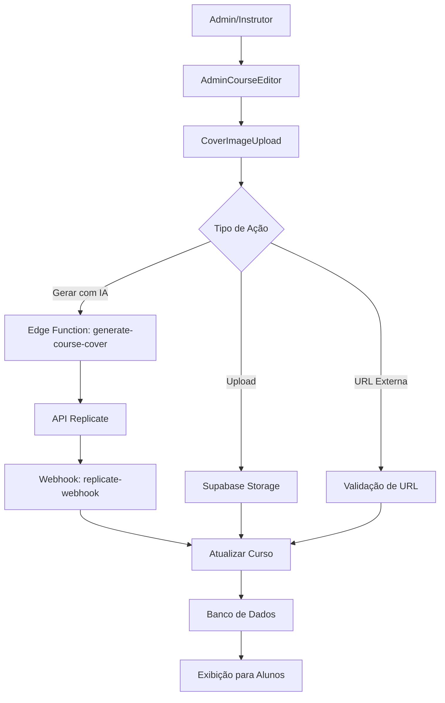

# Sistema de Geração de Capas de Cursos

Este documento descreve o sistema completo de geração automática e manual de capas para cursos na plataforma AI Squads Academy.

## 📋 Visão Geral

O sistema oferece três formas de gerenciar capas de cursos:
1. **Geração Automática com IA** - Usando APIs do Replicate (Flux-1.1-Pro e Recraft-V3)
2. **Upload Manual** - Upload de arquivos de imagem
3. **URL Externa** - Inserção de URL de imagem hospedada externamente

## 🏗️ Arquitetura

### Componentes Principais

1. **Edge Function: `generate-course-cover`**
   - Localização: `supabase/functions/generate-course-cover/index.ts`
   - Responsável por chamar as APIs do Replicate
   - Implementa autenticação, validação e retry automático

2. **Webhook: `replicate-webhook`**
   - Localização: `supabase/functions/replicate-webhook/index.ts`
   - Processa resultados das APIs do Replicate
   - Atualiza automaticamente a capa do curso

3. **Componente Frontend: `CoverImageUpload`**
   - Localização: `src/components/admin/CoverImageUpload.tsx`
   - Interface para gerenciar capas de cursos
   - Integrado ao AdminCourseEditor

4. **Storage: Bucket `course-images`**
   - Armazena imagens enviadas via upload
   - Configurado com políticas de segurança

### Fluxo de Dados



## 🚀 Como Usar

### Para Administradores/Instrutores

1. **Acesse o Editor de Curso**
   - Navegue para `/admin/courses/{id}/edit`
   - Localize a seção "Capa do Curso" no painel lateral

2. **Gerar Capa com IA**
   - Clique em "Adicionar Capa" ou "Alterar Capa"
   - Selecione "Gerar com Inteligência Artificial"
   - Clique em "Gerar Capa com IA"
   - A capa será gerada automaticamente em alguns minutos

3. **Upload Manual**
   - Clique em "Adicionar Capa" ou "Alterar Capa"
   - Selecione "Fazer Upload de Arquivo"
   - Escolha uma imagem (JPEG, PNG, WebP, GIF - máx. 10MB)
   - A capa será atualizada imediatamente

4. **URL Externa**
   - Clique em "Adicionar Capa" ou "Alterar Capa"
   - Selecione "Usar URL Externa"
   - Cole a URL da imagem
   - Clique em "Salvar"

### Para Desenvolvedores

#### Chamada Direta da Edge Function

```javascript
const { data, error } = await supabase.functions.invoke('generate-course-cover', {
  body: {
    courseId: 'uuid-do-curso',
    engine: 'flux', // ou 'recraft'
    regenerate: true // força nova geração
  }
});
```

#### Parâmetros da Edge Function

- `courseId` (string, obrigatório): ID do curso
- `engine` (string, opcional): 'flux' ou 'recraft' (padrão: 'flux')
- `regenerate` (boolean, opcional): força nova geração mesmo se já existe capa

## 🔧 Configuração

### Variáveis de Ambiente Necessárias

```env
# APIs do Replicate
REPLICATE_API_TOKEN=r8_...
REPLICATE_WEBHOOK_SECRET=whsec_...

# Supabase
SUPABASE_URL=https://...
SUPABASE_SERVICE_ROLE_KEY=eyJ...
VITE_SUPABASE_ANON_KEY=eyJ...
```

### Migrações do Banco de Dados

1. **Tabelas de Predições**: `20250201_enhance_replicate_predictions.sql`
2. **Storage e Permissões**: `20250202_setup_course_covers_storage.sql`

### Modelos de IA Suportados

1. **Flux-1.1-Pro** (`black-forest-labs/flux-1.1-pro`)
   - Melhor qualidade geral
   - Mais rápido
   - Recomendado como padrão

2. **Recraft-V3** (`recraft-ai/recraft-v3`)
   - Estilo mais artístico
   - Boa para designs específicos

## 🔒 Segurança e Permissões

### Autenticação
- Apenas usuários com role `admin` ou `instructor` podem gerar/alterar capas
- Validação de JWT token em todas as operações

### Storage
- Bucket `course-images` configurado como público para leitura
- Upload/modificação restrito a admins/instrutores
- Limite de 10MB por arquivo
- Tipos permitidos: JPEG, PNG, WebP, GIF

### Banco de Dados
- RLS (Row Level Security) habilitado
- Políticas específicas para cada role
- Logs de auditoria nas tabelas de eventos

## 🧪 Testes

### Script de Teste Automatizado

```bash
# Executar teste completo
node test-course-cover-generation.js
```

O script testa:
- ✅ Criação de usuário admin
- ✅ Criação de curso de teste
- ✅ Execução da Edge Function
- ✅ Salvamento da predição
- ✅ Processamento do webhook
- ✅ Atualização da capa do curso

### Testes Manuais

1. **Teste de Geração com IA**
   - Criar curso sem capa
   - Usar botão "Gerar capa com IA"
   - Verificar se capa aparece após alguns minutos

2. **Teste de Upload**
   - Preparar imagem de teste
   - Fazer upload via interface
   - Verificar se capa é atualizada imediatamente

3. **Teste de URL Externa**
   - Usar URL de imagem válida
   - Inserir via interface
   - Verificar se capa é atualizada

## 🐛 Troubleshooting

### Problemas Comuns

1. **Erro 401 - Não Autorizado**
   - Verificar se usuário tem role admin/instructor
   - Verificar se token JWT é válido

2. **Erro 500 - Edge Function**
   - Verificar variáveis de ambiente
   - Verificar logs da Edge Function
   - Verificar conectividade com Replicate

3. **Capa não Atualiza**
   - Verificar se webhook está funcionando
   - Verificar logs do webhook
   - Verificar status da predição no banco

4. **Upload Falha**
   - Verificar tamanho do arquivo (máx. 10MB)
   - Verificar tipo do arquivo
   - Verificar permissões do bucket

### Logs e Monitoramento

```sql
-- Verificar predições recentes
SELECT * FROM replicate_predictions 
WHERE created_at > NOW() - INTERVAL '1 hour'
ORDER BY created_at DESC;

-- Verificar eventos de geração
SELECT * FROM generation_events 
WHERE created_at > NOW() - INTERVAL '1 hour'
ORDER BY created_at DESC;

-- Verificar cursos com capas
SELECT id, title, cover_image_url, updated_at 
FROM courses 
WHERE cover_image_url IS NOT NULL
ORDER BY updated_at DESC;
```

## 📈 Métricas e Performance

### Tempos Esperados
- **Geração com IA**: 30-120 segundos
- **Upload Manual**: 1-5 segundos
- **URL Externa**: 1-2 segundos

### Limites
- **Tamanho de arquivo**: 10MB
- **Rate limiting**: Configurado no Replicate
- **Retry automático**: 3 tentativas com backoff exponencial

## 🔄 Manutenção

### Limpeza de Dados

```sql
-- Remover predições antigas (mais de 30 dias)
DELETE FROM replicate_predictions 
WHERE created_at < NOW() - INTERVAL '30 days';

-- Remover eventos antigos (mais de 90 dias)
DELETE FROM generation_events 
WHERE created_at < NOW() - INTERVAL '90 days';
```

### Backup
- Imagens são armazenadas no Supabase Storage
- URLs são salvas na tabela `courses`
- Backup automático via Supabase

## 🚀 Próximos Passos

1. **Melhorias Planejadas**
   - Cache de prompts similares
   - Geração em lote para múltiplos cursos
   - Integração com mais modelos de IA
   - Editor de imagem integrado

2. **Otimizações**
   - Compressão automática de imagens
   - CDN para melhor performance
   - Pré-visualização antes de salvar

## 📞 Suporte

Para problemas ou dúvidas:
1. Verificar logs das Edge Functions
2. Consultar este documento
3. Executar script de teste
4. Contatar equipe de desenvolvimento

---

**Última atualização**: Janeiro 2025  
**Versão**: 1.0  
**Autor**: Sistema AI Squads Academy