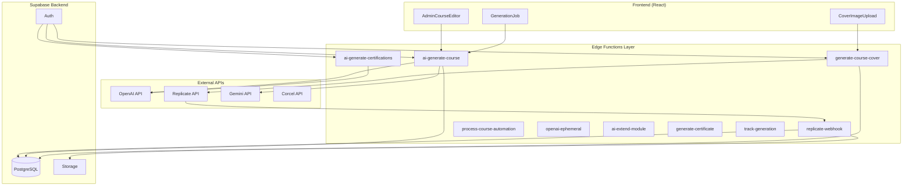
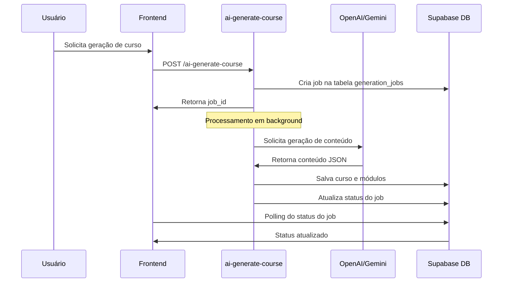
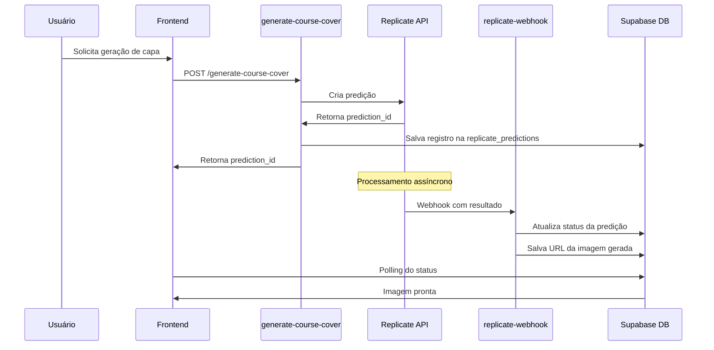
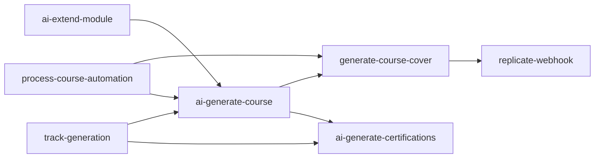
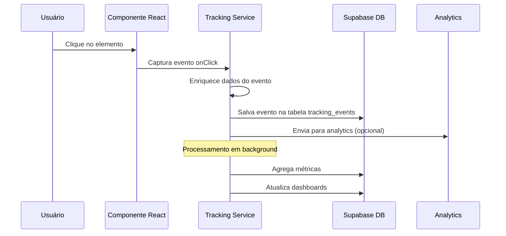

# Edge Functions - Guia Técnico Completo
*Sistema AI Squads Academy*

## 📋 Índice

1. [Definição e Propósito](#definição-e-propósito)
2. [Arquitetura e Fluxo de Execução](#arquitetura-e-fluxo-de-execução)
3. [Catálogo de Edge Functions](#catálogo-de-edge-functions)
4. [Arquivos Dependentes e Relações](#arquivos-dependentes-e-relações)
5. [Rotas e Configurações](#rotas-e-configurações)
6. [Problemas e Desafios Enfrentados](#problemas-e-desafios-enfrentados)
7. [Soluções Implementadas](#soluções-implementadas)
8. [Limitações Técnicas](#limitações-técnicas)
9. [Monitoramento e Debug](#monitoramento-e-debug)
10. [Boas Práticas](#boas-práticas)

---

## 1. Definição e Propósito

### 1.1 O que são Edge Functions?

Edge Functions são funções serverless executadas na infraestrutura do Supabase, baseadas no runtime Deno. Elas funcionam como uma camada de backend que processa requisições HTTP de forma distribuída, próxima aos usuários finais.

### 1.2 Propósito no AI Squads Academy

No contexto da plataforma, as Edge Functions servem para:

- **Integração com APIs de IA**: OpenAI, Replicate, Gemini, Corcel
- **Processamento de webhooks**: Callbacks de APIs externas
- **Geração de conteúdo**: Cursos, certificações, imagens
- **Automação de processos**: Workflows de criação de conteúdo
- **Proxy seguro**: Proteção de chaves de API

### 1.3 Vantagens

- ✅ **Latência baixa**: Execução próxima ao usuário
- ✅ **Escalabilidade automática**: Sem gerenciamento de infraestrutura
- ✅ **Segurança**: Chaves de API protegidas no servidor
- ✅ **Integração nativa**: Acesso direto ao banco Supabase
- ✅ **TypeScript**: Tipagem forte e desenvolvimento produtivo

---

## 2. Arquitetura e Fluxo de Execução

### 2.1 Arquitetura Geral



### 2.2 Fluxo de Execução Típico

#### Geração de Curso com IA



#### Geração de Capa com Replicate



---

## 3. Catálogo de Edge Functions

### 3.1 ai-generate-course

**Propósito**: Geração completa de cursos usando IA

**Características**:
- Suporte a múltiplos provedores (OpenAI, Gemini)
- Fallback automático entre provedores
- Processamento em background com jobs
- Progresso em tempo real
- Validação robusta de JSON

**Parâmetros de Entrada**:
```typescript
interface GenerateCourseRequest {
  topic: string;                    // Tópico principal do curso
  title?: string;                   // Título personalizado (opcional)
  difficulty: 'beginner' | 'intermediate' | 'advanced'; // Nível de dificuldade
  num_modules: number;              // Número de módulos (padrão: 12, máx: 20)
  audience: string;                 // Público-alvo (padrão: "estudantes e profissionais de TI no Brasil")
  include_final_exam: boolean;      // Incluir prova final (padrão: true)
  final_exam_difficulty?: string;   // Dificuldade da prova final
  final_exam_options?: number;      // Número de opções por questão (padrão: 4)
  final_exam_questions?: number;    // Número de questões (padrão: 20)
  description?: string;             // Descrição adicional do curso
  tone: string;                     // Tom do curso (padrão: "profissional")
  target_audience: string[];        // Array de público-alvo específico
  module_length_min: number;        // Tamanho mínimo do módulo em caracteres (padrão: 2200)
  module_length_max: number;        // Tamanho máximo do módulo em caracteres (padrão: 3200)
}
```

**Parâmetros de Saída**:
```typescript
interface GenerateCourseResponse {
  job_id: string;                   // ID do job para acompanhamento
  message: string;                  // Mensagem de confirmação
}

// Estrutura do job de geração
interface GenerationJob {
  id: string;
  type: 'ai_generate_course';
  status: 'queued' | 'processing' | 'completed' | 'failed';
  input: GenerateCourseRequest;
  output?: {
    events: Array<{message: string; at: string}>;
    progress_modules: Array<{index: number; title: string}>;
    course_id?: string;
  };
  error?: string;
  created_by: string;
  created_at: string;
  updated_at: string;
}
```

### 3.2 generate-course-cover

**Propósito**: Geração de capas de curso usando Replicate

**Características**:
- Suporte a múltiplos engines (Flux, Recraft)
- Retry automático com backoff exponencial
- Validação de permissões
- Verificação de duplicatas
- Webhooks para processamento assíncrono

**Parâmetros de Entrada**:
```typescript
interface GenerateCoverRequest {
  courseId: string;                 // ID do curso para gerar capa
  engine?: 'flux' | 'recraft';     // Engine de geração (padrão: 'flux')
  regenerate?: boolean;             // Forçar regeneração mesmo se já existir (padrão: false)
}
```

**Parâmetros de Saída**:
```typescript
interface GenerateCoverResponse {
  prediction_id: string;            // ID da predição no Replicate
  status: string;                   // Status inicial da predição
  message: string;                  // Mensagem de confirmação
}

// Estrutura da predição salva no banco
interface ReplicatePrediction {
  id: string;
  prediction_id: string;           // ID único da predição no Replicate
  course_id: string;               // ID do curso relacionado
  module_id?: string;              // ID do módulo (se aplicável)
  prediction_type: 'course_cover'; // Tipo da predição
  status: 'starting' | 'processing' | 'succeeded' | 'failed' | 'canceled';
  input: {
    prompt: string;                // Prompt gerado para a IA
    engine: string;                // Engine utilizado
    type: string;                  // Tipo de geração
    timestamp: string;             // Timestamp da criação
  };
  output?: string;                 // URL da imagem gerada (quando sucesso)
  error?: string;                  // Mensagem de erro (quando falha)
  logs?: string;                   // Logs do processamento
  metrics?: {
    predict_time?: number;         // Tempo de predição em segundos
    total_time?: number;           // Tempo total em segundos
    processed_at: string;          // Timestamp do processamento
  };
  created_at: string;
  updated_at: string;
  completed_at?: string;
}
```

### 3.3 replicate-webhook

**Propósito**: Processamento de callbacks do Replicate

**Características**:
- Verificação de assinatura HMAC
- Retry automático com backoff
- Processamento de múltiplos tipos de predição
- Logs detalhados para auditoria
- Atualização automática de registros

**Parâmetros de Entrada** (Webhook Payload):
```typescript
interface WebhookPayload {
  id: string;                       // ID da predição
  status: 'starting' | 'processing' | 'succeeded' | 'failed' | 'canceled';
  output?: string | string[];       // Resultado da predição (URLs de imagem)
  error?: string;                   // Mensagem de erro (se falhou)
  logs?: string;                    // Logs do processamento
  metrics?: {
    predict_time?: number;          // Tempo de predição
    total_time?: number;            // Tempo total
  };
  input: Record<string, any>;       // Parâmetros de entrada originais
  created_at: string;               // Timestamp de criação
  completed_at?: string;            // Timestamp de conclusão
}
```

**Headers Obrigatórios**:
```typescript
interface WebhookHeaders {
  'Replicate-Signature': string;   // Assinatura HMAC SHA-256 para verificação
  'Content-Type': 'application/json';
}
```

**Processamento**:
- Verifica assinatura HMAC com `REPLICATE_WEBHOOK_SECRET`
- Atualiza status na tabela `replicate_predictions`
- Para status 'succeeded': atualiza `cover_image_url` na tabela `courses`
- Registra eventos na tabela de logs para auditoria
- Implementa retry automático com backoff exponencial

### 3.4 ai-generate-certifications

**Propósito**: Geração de missões e quizzes para certificação

**Características**:
- Geração de missões práticas
- Criação de quizzes com múltiplas questões
- Suporte a diferentes tipos de questão
- Validação de contexto (curso/trilha)

**Parâmetros de Entrada**:
```typescript
interface GenerateCertificationsRequest {
  type: 'missions' | 'quizzes';     // Tipo de conteúdo a gerar
  trackId?: string;                 // ID da trilha (opcional)
  courseId?: string;                // ID do curso (opcional)
  count?: number;                   // Quantidade a gerar (padrão: 3)
  difficulty?: 'beginner' | 'intermediate' | 'advanced'; // Dificuldade (padrão: 'intermediate')
  missionType?: 'practical' | 'theoretical'; // Tipo de missão (padrão: 'practical')
  questionTypes?: string[];         // Tipos de questão (padrão: ['multiple_choice'])
  basePoints?: number;              // Pontos base para missões (padrão: 50)
}
```

**Parâmetros de Saída**:
```typescript
// Para type: 'missions'
interface MissionResponse {
  title: string;                    // Título da missão
  description: string;              // Descrição detalhada
  points: number;                   // Pontos da missão
  status: 'available';              // Status inicial
  order_index: number;              // Ordem na sequência
  requirements: string[];           // Lista de requisitos
}

// Para type: 'quizzes'
interface QuizResponse {
  title: string;                    // Título do quiz
  description: string;              // Descrição do quiz
  is_active: boolean;               // Se está ativo
  questions: Array<{
    question: string;               // Texto da pergunta
    type: 'multiple_choice';        // Tipo da questão
    options: string[];              // Opções de resposta
    correct_answer: string;         // Resposta correta
    explanation: string;            // Explicação da resposta
  }>;
}

// Resposta da API
interface CertificationsApiResponse {
  success: boolean;
  data: MissionResponse[] | QuizResponse[];
  message?: string;
}
```

### 3.5 process-course-automation

**Propósito**: Automação de processos de criação de curso

**Características**:
- Processamento em lote de jobs
- Orquestração de múltiplas Edge Functions
- Tratamento de erros robusto
- Limite de processamento simultâneo

**Parâmetros de Entrada**:
```typescript
interface ProcessAutomationRequest {
  action: 'process_cover_queue' | 'batch_generate' | 'cleanup_jobs';
  limit?: number;                   // Limite de jobs a processar (padrão: 10)
  course_ids?: string[];            // IDs específicos de cursos (opcional)
  force?: boolean;                  // Forçar reprocessamento (padrão: false)
}
```

**Parâmetros de Saída**:
```typescript
interface ProcessAutomationResponse {
  success: boolean;
  processed_count: number;          // Número de jobs processados
  failed_count: number;             // Número de falhas
  skipped_count: number;            // Número de jobs ignorados
  details: Array<{
    job_id: string;
    status: 'processed' | 'failed' | 'skipped';
    message?: string;
    error?: string;
  }>;
  execution_time_ms: number;        // Tempo de execução em milissegundos
}
```

### 3.6 openai-ephemeral

**Propósito**: Criação de sessões de chat em tempo real

**Características**:
- Integração com OpenAI Realtime API
- Configuração de voz e instruções
- Sessões efêmeras para chat

**Parâmetros de Entrada**:
```typescript
interface EphemeralSessionRequest {
  instructions?: string;            // Instruções do sistema para o assistente
  voice?: 'alloy' | 'echo' | 'fable' | 'onyx' | 'nova' | 'shimmer';
  temperature?: number;             // Temperatura da resposta (0.0 - 1.0)
  max_response_output_tokens?: number; // Limite de tokens na resposta
  modalities?: ('text' | 'audio')[]; // Modalidades suportadas
  tool_choice?: 'auto' | 'none';    // Escolha de ferramentas
}
```

**Parâmetros de Saída**:
```typescript
interface EphemeralSessionResponse {
  client_secret: {
    value: string;                  // Token de acesso para o cliente
    expires_at: number;             // Timestamp de expiração
  };
  session_id: string;               // ID da sessão criada
  expires_at: number;               // Timestamp de expiração da sessão
}
```

### 3.7 ai-extend-module

**Propósito**: Extensão de módulos de curso existentes

**Características**:
- Análise de conteúdo existente
- Geração de conteúdo adicional
- Manutenção de consistência

**Parâmetros de Entrada**:
```typescript
interface ExtendModuleRequest {
  moduleId: string;                 // ID do módulo a ser estendido
  extensionType: 'content' | 'exercises' | 'examples' | 'summary';
  targetLength?: number;            // Tamanho alvo do conteúdo adicional
  tone?: string;                    // Tom do conteúdo (padrão: 'profissional')
  focus?: string;                   // Foco específico da extensão
}
```

**Parâmetros de Saída**:
```typescript
interface ExtendModuleResponse {
  success: boolean;
  module_id: string;
  original_content_length: number;
  extended_content_length: number;
  extension_added: {
    type: string;
    content: string;
    position: 'append' | 'prepend' | 'insert';
  };
  updated_at: string;
}
```

### 3.8 generate-certificate

**Propósito**: Geração de certificados de conclusão

**Características**:
- Templates personalizáveis
- Validação de conclusão
- Geração de PDF

**Parâmetros de Entrada**:
```typescript
interface GenerateCertificateRequest {
  userId: string;                   // ID do usuário
  courseId?: string;                // ID do curso (opcional)
  trackId?: string;                 // ID da trilha (opcional)
  templateId?: string;              // ID do template (opcional)
  customData?: {
    student_name: string;
    course_title: string;
    completion_date: string;
    instructor_name?: string;
    certificate_id: string;
    additional_info?: Record<string, any>;
  };
}
```

**Parâmetros de Saída**:
```typescript
interface GenerateCertificateResponse {
  success: boolean;
  certificate_id: string;           // ID único do certificado
  pdf_url: string;                  // URL do PDF gerado
  verification_code: string;        // Código de verificação
  issued_at: string;                // Data de emissão
  expires_at?: string;              // Data de expiração (se aplicável)
  metadata: {
    template_used: string;
    generation_time_ms: number;
    file_size_bytes: number;
  };
}
```

### 3.9 track-generation

**Propósito**: Geração de trilhas de aprendizado

**Características**:
- Sequenciamento inteligente
- Análise de pré-requisitos
- Otimização de percurso

**Parâmetros de Entrada**:
```typescript
interface TrackGenerationRequest {
  title: string;                    // Título da trilha
  description?: string;             // Descrição da trilha
  target_audience: string[];        // Público-alvo
  difficulty_progression: 'linear' | 'adaptive' | 'branched';
  course_ids?: string[];            // IDs de cursos existentes para incluir
  learning_objectives: string[];    // Objetivos de aprendizado
  estimated_duration_hours?: number; // Duração estimada em horas
  prerequisites?: string[];         // Pré-requisitos
  certification_enabled?: boolean;  // Habilitar certificação
}
```

**Parâmetros de Saída**:
```typescript
interface TrackGenerationResponse {
  success: boolean;
  track_id: string;                 // ID da trilha criada
  track_structure: {
    title: string;
    description: string;
    total_courses: number;
    estimated_duration_hours: number;
    difficulty_levels: string[];
    course_sequence: Array<{
      course_id: string;
      order_index: number;
      title: string;
      prerequisites: string[];
      estimated_hours: number;
    }>;
  };
  recommendations: {
    suggested_missions: string[];
    related_tracks: string[];
    next_steps: string[];
  };
  created_at: string;
}
```

---

## 4. Arquivos Dependentes e Relações

### 4.1 Estrutura Detalhada de Diretórios e Arquivos

#### Estrutura Geral
```
supabase/functions/
├── ai-generate-course/
│   └── index.ts                 # Geração de cursos (379 linhas)
├── generate-course-cover/
│   └── index.ts                 # Geração de capas (535 linhas)
├── replicate-webhook/
│   └── index.ts                 # Webhook do Replicate (439 linhas)
├── ai-generate-certifications/
│   └── index.ts                 # Certificações e quizzes (266 linhas)
├── process-course-automation/
│   └── index.ts                 # Automação de processos
├── openai-ephemeral/
│   └── index.ts                 # Chat em tempo real
├── ai-extend-module/
│   └── index.ts                 # Extensão de módulos
├── generate-certificate/
│   └── index.ts                 # Geração de certificados
└── track-generation/
    └── index.ts                 # Geração de trilhas
```

#### Detalhamento por Função

##### ai-generate-course/
**Arquivo**: `index.ts` (379 linhas)
**Finalidade**: Geração completa de cursos usando IA
**Dependências**:
- `https://deno.land/x/xhr@0.1.0/mod.ts` - Polyfill XMLHttpRequest
- `https://deno.land/std@0.168.0/http/server.ts` - Servidor HTTP Deno
- `https://esm.sh/@supabase/supabase-js@2.7.1` - Cliente Supabase

**Funções principais**:
- `safeJsonParse()` - Parser robusto de JSON com fallbacks
- `callOpenAI()` - Integração com API OpenAI GPT-4o-mini
- `callGemini()` - Integração com API Gemini 1.5-flash
- `backgroundTask()` - Processamento assíncrono de geração

**Variáveis de ambiente**:
- `SUPABASE_URL`, `SUPABASE_SERVICE_ROLE_KEY`, `SUPABASE_ANON_KEY`
- `OPENAI_API_KEY`, `GEMINI_API_KEY`

##### generate-course-cover/
**Arquivo**: `index.ts` (535 linhas)
**Finalidade**: Geração de capas usando Replicate API
**Dependências**:
- `https://deno.land/x/xhr@0.1.0/mod.ts`
- `https://deno.land/std@0.168.0/http/server.ts`
- `https://esm.sh/@supabase/supabase-js@2.39.7`

**Interfaces principais**:
- `GenerateCoverRequest` - Parâmetros de entrada
- `CourseData` - Dados do curso
- `ReplicateResponse` - Resposta da API Replicate

**Funções principais**:
- `validateRequest()` - Validação de entrada
- `checkUserPermissions()` - Verificação de permissões
- `getCourseData()` - Busca dados do curso
- `generatePrompt()` - Geração de prompts otimizados
- `callReplicateAPI()` - Chamada com retry automático
- `savePrediction()` - Salvamento no banco com retry

**Engines suportados**:
- Flux: `black-forest-labs/flux-1.1-pro`
- Recraft: `recraft-ai/recraft-v3`

##### replicate-webhook/
**Arquivo**: `index.ts` (439 linhas)
**Finalidade**: Processamento de webhooks do Replicate
**Dependências**:
- `https://deno.land/x/xhr@0.1.0/mod.ts`
- `https://deno.land/std@0.168.0/http/server.ts`
- `https://esm.sh/@supabase/supabase-js@2.39.7`

**Interfaces principais**:
- `WebhookPayload` - Estrutura do payload

**Funções principais**:
- `verifyWebhookSignature()` - Verificação HMAC SHA-256
- `processWebhookWithRetry()` - Processamento com retry
- `processWebhook()` - Lógica principal de processamento
- `processSuccessfulGeneration()` - Atualização de recursos
- `updateGenerationJobStatus()` - Atualização de jobs
- `logGenerationEvent()` - Registro de eventos

##### ai-generate-certifications/
**Arquivo**: `index.ts` (266 linhas)
**Finalidade**: Geração de missões e quizzes
**Dependências**:
- `https://deno.land/x/xhr@0.1.0/mod.ts`
- `https://deno.land/std@0.168.0/http/server.ts`
- `https://esm.sh/@supabase/supabase-js@2.7.1`

**Funções principais**:
- `extractJsonArray()` - Extração de arrays JSON
- Integração com OpenAI GPT-4o-mini
- Suporte a contexto de cursos e trilhas

**Tipos suportados**:
- `missions` - Missões práticas
- `quizzes` - Quizzes de certificação

#### Dependências Compartilhadas

**Bibliotecas Deno Padrão**:
```typescript
// Todas as funções usam
import "https://deno.land/x/xhr@0.1.0/mod.ts";
import { serve } from "https://deno.land/std@0.168.0/http/server.ts";
import { createClient } from "https://esm.sh/@supabase/supabase-js@2.39.7";
```

**Headers CORS Padrão**:
```typescript
const corsHeaders = {
  "Access-Control-Allow-Origin": "*",
  "Access-Control-Allow-Headers": "authorization, x-client-info, apikey, content-type",
};
```

#### Relacionamentos entre Funções



**Fluxos de dependência**:
1. **Geração de curso** → **Geração de capa** → **Webhook de processamento**
2. **Automação** → **Múltiplas funções de geração**
3. **Trilhas** → **Cursos** → **Certificações**

### 4.2 Dependências Externas

#### Bibliotecas Deno
```typescript
// Padrão em todas as functions
import "https://deno.land/x/xhr@0.1.0/mod.ts";
import { serve } from "https://deno.land/std@0.168.0/http/server.ts";
import { createClient } from "https://esm.sh/@supabase/supabase-js@2.39.7";
```

#### Variáveis de Ambiente
```bash
# Supabase
SUPABASE_URL
SUPABASE_ANON_KEY
SUPABASE_SERVICE_ROLE_KEY

# APIs de IA
OPENAI_API_KEY
GEMINI_API_KEY
CORCEL_API_KEY
REPLICATE_API_TOKEN

# Webhooks
REPLICATE_WEBHOOK_SECRET
```

### 4.3 Tabelas do Banco de Dados

#### Principais Tabelas Utilizadas

```sql
-- Jobs de geração
generation_jobs (
  id, type, status, input, output, error, created_by, created_at, updated_at
)

-- Predições do Replicate
replicate_predictions (
  id, prediction_id, status, input, output, error, course_id, module_id, 
  prediction_type, created_at, updated_at, completed_at
)

-- Cursos e módulos
courses (id, title, description, cover_image_url, ...)
modules (id, course_id, title, content_html, ...)

-- Certificações
missions (id, title, description, points, ...)
quizzes (id, title, description, questions, ...)

-- Perfis e permissões
profiles (id, user_id, role, ...)
```

---

## 5. Rotas e Configurações

### 5.1 Endpoints das Edge Functions

```bash
# Base URL
https://{project-id}.supabase.co/functions/v1/

# Endpoints disponíveis
POST /ai-generate-course
POST /generate-course-cover
POST /replicate-webhook
POST /ai-generate-certifications
POST /process-course-automation
POST /openai-ephemeral
POST /ai-extend-module
POST /generate-certificate
POST /track-generation
```

### 5.2 Configuração CORS

```typescript
const corsHeaders = {
  "Access-Control-Allow-Origin": "*",
  "Access-Control-Allow-Headers": "authorization, x-client-info, apikey, content-type",
};
```

### 5.3 Autenticação

```typescript
// Cliente anônimo (com token do usuário)
const anonClient = createClient(SUPABASE_URL, SUPABASE_ANON_KEY, {
  global: { headers: { Authorization: req.headers.get("Authorization") || "" } },
});

// Cliente de serviço (acesso total)
const serviceClient = createClient(SUPABASE_URL, SUPABASE_SERVICE_ROLE_KEY);
```

---

## 6. Problemas e Desafios Enfrentados

### 6.1 Limitações de Runtime

#### **Problema**: Timeout de Execução
- **Descrição**: Edge Functions têm limite de 60 segundos de execução
- **Impacto**: Geração de cursos longos pode exceder o limite
- **Sintomas**: Erro 504 Gateway Timeout

#### **Problema**: Limite de Memória
- **Descrição**: Restrição de memória para processamento de dados grandes
- **Impacto**: Falha ao processar cursos com muitos módulos
- **Sintomas**: Out of Memory errors

#### **Problema**: Cold Start
- **Descrição**: Latência inicial alta em funções não utilizadas recentemente
- **Impacto**: Primeira requisição lenta (2-5 segundos)
- **Sintomas**: Timeout em requisições iniciais

### 6.2 Integração com APIs Externas

#### **Problema**: Rate Limiting
- **Descrição**: APIs externas limitam número de requisições
- **Impacto**: Falhas intermitentes em alta demanda
- **Sintomas**: Erro 429 Too Many Requests

```typescript
// Exemplo de erro comum
{
  "error": {
    "message": "Rate limit exceeded",
    "type": "rate_limit_error",
    "code": "rate_limit_exceeded"
  }
}
```

#### **Problema**: Instabilidade de APIs
- **Descrição**: APIs de IA podem ter indisponibilidade temporária
- **Impacto**: Falhas na geração de conteúdo
- **Sintomas**: Erro 503 Service Unavailable

#### **Problema**: Parsing de Resposta
- **Descrição**: APIs de IA retornam JSON malformado
- **Impacto**: Falha no processamento de conteúdo gerado
- **Sintomas**: JSON Parse Error

```typescript
// Exemplo de resposta problemática
"```json\n{\n  \"title\": \"Curso\",\n  \"modules\": [\n    {\"title\": \"Módulo 1\",}\n  ]\n}\n```"
```

### 6.3 Problemas de Concorrência

#### **Problema**: Race Conditions
- **Descrição**: Múltiplas requisições simultâneas para o mesmo recurso
- **Impacto**: Duplicação de dados ou estados inconsistentes
- **Sintomas**: Registros duplicados no banco

#### **Problema**: Deadlocks de Banco
- **Descrição**: Transações concorrentes travando
- **Impacto**: Timeout em operações de banco
- **Sintomas**: Erro de timeout em queries

### 6.4 Problemas de Webhook

#### **Problema**: Verificação de Assinatura
- **Descrição**: Implementação complexa de HMAC SHA-256
- **Impacto**: Webhooks rejeitados incorretamente
- **Sintomas**: Erro 401 Unauthorized

#### **Problema**: Reprocessamento
- **Descrição**: Webhooks podem ser enviados múltiplas vezes
- **Impacto**: Processamento duplicado
- **Sintomas**: Dados inconsistentes

#### **Problema**: Ordem de Chegada
- **Descrição**: Webhooks podem chegar fora de ordem
- **Impacto**: Estados inconsistentes
- **Sintomas**: Status incorreto de predições

### 6.5 Problemas de Monitoramento

#### **Problema**: Logs Limitados
- **Descrição**: Logs das Edge Functions são limitados
- **Impacto**: Dificuldade para debug
- **Sintomas**: Informações insuficientes para troubleshooting

#### **Problema**: Métricas Insuficientes
- **Descrição**: Falta de métricas detalhadas de performance
- **Impacto**: Dificuldade para otimização
- **Sintomas**: Performance degradada sem visibilidade

---

## 7. Soluções Implementadas

### 7.1 Solução para Timeouts

#### **Processamento Assíncrono com Jobs**

```typescript
// Padrão implementado em ai-generate-course
const { data: jobRow } = await serviceClient
  .from("generation_jobs")
  .insert({
    type: "ai_generate_course",
    status: "queued",
    input: requestData,
    created_by: profileId,
  })
  .select("id")
  .single();

// Retorna imediatamente o job_id
return new Response(JSON.stringify({ job_id: jobRow.id }));

// Processamento em background
const backgroundTask = async () => {
  // Processamento longo aqui
};

// Não aguarda o resultado
backgroundTask().catch(console.error);
```

#### **Polling no Frontend**

```typescript
// Frontend monitora progresso via polling
const pollJobStatus = async (jobId: string) => {
  const interval = setInterval(async () => {
    const { data } = await supabase
      .from('generation_jobs')
      .select('status, output')
      .eq('id', jobId)
      .single();
      
    if (data.status === 'completed' || data.status === 'failed') {
      clearInterval(interval);
      // Atualizar UI
    }
  }, 1500);
};
```

### 7.2 Solução para Rate Limiting

#### **Retry com Backoff Exponencial**

```typescript
async function callWithRetry<T>(
  apiCall: () => Promise<T>,
  maxRetries: number = 3
): Promise<T> {
  let lastError: any;
  
  for (let attempt = 0; attempt <= maxRetries; attempt++) {
    try {
      return await apiCall();
    } catch (error: any) {
      lastError = error;
      
      if (attempt === maxRetries) break;
      
      // Backoff exponencial
      const delay = Math.min(1000 * Math.pow(2, attempt), 10000);
      await new Promise(resolve => setTimeout(resolve, delay));
    }
  }
  
  throw lastError;
}
```

#### **Fallback entre Provedores**

```typescript
// Implementado em ai-generate-course
let contentText: string | null = null;
try {
  contentText = await callOpenAI(messages, 0.6);
} catch (e1) {
  await logEvent("OpenAI falhou, tentando Gemini...");
  contentText = await callGemini(messages, 0.6);
}
```

### 7.3 Solução para Parsing de JSON

#### **Parser Robusto**

```typescript
const safeJsonParse = (text: string): any => {
  try {
    // Tentativa direta
    return JSON.parse(text);
  } catch (_) {
    // Extrair de bloco ```json ... ```
    const match = text.match(/```json\n([\s\S]*?)\n```/i);
    if (match) {
      try { return JSON.parse(match[1]); } catch (_) {}
    }
    
    // Remover vírgulas finais
    try {
      const cleaned = text.replace(/,\s*([}\]])/g, "$1");
      return JSON.parse(cleaned);
    } catch (e) {
      console.error("Failed to parse JSON:", e);
      return null;
    }
  }
};
```

### 7.4 Solução para Webhooks

#### **Verificação de Assinatura Segura**

```typescript
async function verifyWebhookSignature(
  body: string,
  signature: string,
  secret: string
): Promise<boolean> {
  try {
    const expectedSignature = signature.replace("sha256=", "");
    
    const key = await crypto.subtle.importKey(
      "raw",
      new TextEncoder().encode(secret),
      { name: "HMAC", hash: "SHA-256" },
      false,
      ["sign"]
    );
    
    const signatureBuffer = await crypto.subtle.sign(
      "HMAC",
      key,
      new TextEncoder().encode(body)
    );
    
    const calculatedSignature = Array.from(new Uint8Array(signatureBuffer))
      .map(b => b.toString(16).padStart(2, "0"))
      .join("");
    
    return calculatedSignature === expectedSignature;
  } catch (error) {
    console.error("Erro ao verificar assinatura:", error);
    return false;
  }
}
```

#### **Idempotência**

```typescript
// Verificar se já foi processado
const { data: existing } = await supabase
  .from('replicate_predictions')
  .select('id')
  .eq('prediction_id', payload.id)
  .eq('status', 'succeeded')
  .single();

if (existing) {
  console.log('Webhook já processado:', payload.id);
  return;
}
```

### 7.5 Solução para Concorrência

#### **Locks Otimistas**

```typescript
// Usar timestamps para evitar race conditions
const { data, error } = await supabase
  .from('courses')
  .update({ 
    cover_image_url: imageUrl,
    updated_at: new Date().toISOString()
  })
  .eq('id', courseId)
  .eq('updated_at', lastKnownTimestamp); // Condição de lock otimista

if (error || !data.length) {
  throw new Error('Recurso foi modificado por outro processo');
}
```

### 7.6 Solução para Monitoramento

#### **Logs Estruturados**

```typescript
const logEvent = async (message: string, metadata?: any) => {
  const logEntry = {
    timestamp: new Date().toISOString(),
    function: 'ai-generate-course',
    message,
    metadata,
    job_id: jobId
  };
  
  console.log(JSON.stringify(logEntry));
  
  // Salvar no banco para auditoria
  await serviceClient
    .from('function_logs')
    .insert(logEntry);
};
```

#### **Health Checks**

```typescript
// Endpoint de health check
if (req.url.endsWith('/health')) {
  return new Response(JSON.stringify({
    status: 'healthy',
    timestamp: new Date().toISOString(),
    version: '1.0.0'
  }), {
    headers: { ...corsHeaders, 'Content-Type': 'application/json' }
  });
}
```

---

## 8. Limitações Técnicas

### 8.1 Limitações do Runtime Deno

| Limitação | Valor | Impacto |
|-----------|-------|----------|
| Tempo de execução | 60 segundos | Processamento longo deve ser assíncrono |
| Memória | 512 MB | Limita tamanho de dados processados |
| Tamanho da resposta | 6 MB | Respostas grandes devem usar streaming |
| Conexões simultâneas | 1000 | Limite de requisições concorrentes |
| Cold start | 2-5 segundos | Primeira requisição é lenta |

### 8.2 Limitações de APIs Externas

#### OpenAI
- **Rate Limit**: 3,500 RPM (requests per minute)
- **Token Limit**: 128k tokens por requisição
- **Timeout**: 60 segundos
- **Custo**: $0.15 por 1M tokens (input) + $0.60 por 1M tokens (output)

#### Replicate
- **Rate Limit**: 100 predições simultâneas
- **Timeout**: 10 minutos por predição
- **Custo**: Varia por modelo ($0.003-$0.05 por imagem)
- **Queue**: Pode haver fila em horários de pico

#### Gemini
- **Rate Limit**: 1,500 RPM
- **Token Limit**: 1M tokens por requisição
- **Timeout**: 60 segundos
- **Custo**: $0.075 por 1M tokens

### 8.3 Limitações do Supabase

- **Conexões de DB**: 60 conexões simultâneas (plano Pro)
- **Storage**: 100 GB incluído
- **Bandwidth**: 250 GB/mês incluído
- **Edge Functions**: 500k invocações/mês incluído

---

## 9. Monitoramento e Debug

### 9.1 Logs das Edge Functions

#### **Acessar Logs**

```bash
# Via Supabase CLI
supabase functions logs --function-name ai-generate-course

# Logs em tempo real
supabase functions logs --function-name ai-generate-course --follow

# Filtrar por período
supabase functions logs --function-name ai-generate-course --since 1h
```

#### **Estrutura de Logs**

```json
{
  "timestamp": "2025-01-20T10:30:00.000Z",
  "level": "INFO",
  "function": "ai-generate-course",
  "message": "Processing job 123e4567-e89b-12d3-a456-426614174000",
  "metadata": {
    "job_id": "123e4567-e89b-12d3-a456-426614174000",
    "user_id": "user_123",
    "course_topic": "Cibersegurança"
  }
}
```

### 9.2 Métricas de Performance

#### **Queries de Monitoramento**

```sql
-- Jobs por status (últimas 24h)
SELECT 
  type,
  status,
  COUNT(*) as count,
  AVG(EXTRACT(EPOCH FROM (updated_at - created_at))) as avg_duration_seconds
FROM generation_jobs 
WHERE created_at > NOW() - INTERVAL '24 hours'
GROUP BY type, status;

-- Predições do Replicate por status
SELECT 
  prediction_type,
  status,
  COUNT(*) as count,
  AVG(EXTRACT(EPOCH FROM (completed_at - created_at))) as avg_duration_seconds
FROM replicate_predictions 
WHERE created_at > NOW() - INTERVAL '24 hours'
GROUP BY prediction_type, status;

-- Taxa de erro por função
SELECT 
  function_name,
  COUNT(*) as total_calls,
  SUM(CASE WHEN status = 'error' THEN 1 ELSE 0 END) as error_count,
  (SUM(CASE WHEN status = 'error' THEN 1 ELSE 0 END) * 100.0 / COUNT(*)) as error_rate
FROM function_logs 
WHERE timestamp > NOW() - INTERVAL '24 hours'
GROUP BY function_name;
```

### 9.3 Alertas e Notificações

#### **Configuração de Alertas**

```sql
-- Trigger para alertas de erro
CREATE OR REPLACE FUNCTION notify_function_error()
RETURNS TRIGGER AS $$
BEGIN
  IF NEW.status = 'failed' THEN
    -- Enviar notificação (webhook, email, etc.)
    PERFORM pg_notify('function_error', json_build_object(
      'function', NEW.type,
      'job_id', NEW.id,
      'error', NEW.error
    )::text);
  END IF;
  RETURN NEW;
END;
$$ LANGUAGE plpgsql;

CREATE TRIGGER generation_jobs_error_trigger
  AFTER UPDATE ON generation_jobs
  FOR EACH ROW
  EXECUTE FUNCTION notify_function_error();
```

### 9.4 Debug de Problemas Comuns

#### **Checklist de Debug**

1. **Verificar Logs**
   ```bash
   supabase functions logs --function-name <function-name> --since 1h
   ```

2. **Testar Conectividade**
   ```bash
   curl -X POST https://your-project.supabase.co/functions/v1/<function-name>/health
   ```

3. **Verificar Variáveis de Ambiente**
   ```bash
   supabase secrets list
   ```

4. **Monitorar Banco de Dados**
   ```sql
   SELECT * FROM generation_jobs WHERE status = 'failed' ORDER BY created_at DESC LIMIT 10;
   ```

5. **Verificar Rate Limits**
   - OpenAI: Dashboard → Usage
   - Replicate: Account → Usage
   - Supabase: Dashboard → Settings → Usage

---

## 10. Sistema de Click Tracking

### 10.1 Visão Geral

O sistema de click tracking da plataforma AI Squads Academy monitora interações dos usuários para análise de comportamento, otimização de UX e métricas de engajamento. O tracking é implementado principalmente através de eventos `onClick` nos componentes React.

### 10.2 Elementos Rastreados

#### Navegação e Interface
```typescript
// Botões de navegação
<Button onClick={() => navigate('/admin/courses')}>Cursos</Button>
<Button onClick={() => navigate('/admin/ai-generator')}>Gerador IA</Button>
<Button onClick={() => navigate(-1)}>Voltar</Button>

// Sidebar e menus
<button onClick={() => setSelectedId(track.id)}>Selecionar Trilha</button>
<Button onClick={() => setState(prev => ({ ...prev, sidebarOpen: !prev.sidebarOpen }))}>Toggle Sidebar</Button>
```

#### Ações de Curso e Conteúdo
```typescript
// Interações com cursos
<Button onClick={() => handleGenerateImages(course.id)}>Gerar Imagens</Button>
<Button onClick={handleCreateCourse}>Criar Curso</Button>
<Button onClick={() => selectModule(module)}>Selecionar Módulo</Button>
<Button onClick={() => toggleModuleCompletion(module.id)}>Marcar Completo</Button>

// Quiz e avaliações
<Button onClick={handleSubmitQuiz}>Enviar Quiz</Button>
<Button onClick={nextQuestion}>Próxima Questão</Button>
<Button onClick={previousQuestion}>Questão Anterior</Button>
```

#### Gamificação e Social
```typescript
// Interações sociais
<Button onClick={() => onLike(activity.id)}>Curtir</Button>
<Button onClick={() => onComment(activity.id)}>Comentar</Button>
<Button onClick={() => onShare(activity.id)}>Compartilhar</Button>

// Conquistas e certificados
<Button onClick={() => shareAchievement(userBadge)}>Compartilhar Conquista</Button>
<Button onClick={() => downloadCertificate(userBadge)}>Baixar Certificado</Button>
<Button onClick={generateCertificate}>Gerar Certificado</Button>
```

#### Administração e Gestão
```typescript
// Ações administrativas
<Button onClick={() => setShowCreateUserDialog(true)}>Criar Usuário</Button>
<Button onClick={() => setShowCreateCourseDialog(true)}>Criar Curso</Button>
<Button onClick={() => handleDeleteUser(user.id)}>Deletar Usuário</Button>
<Button onClick={() => handleDeleteCourse(course.id)}>Deletar Curso</Button>

// Geração com IA
<Button onClick={handleStartAIGeneration}>Iniciar Geração IA</Button>
<Button onClick={resetGeneration}>Resetar Geração</Button>
```

### 10.3 Dados Coletados

#### Estrutura de Evento Padrão
```typescript
interface ClickTrackingEvent {
  event_type: 'click' | 'navigation' | 'interaction';
  element_type: 'button' | 'link' | 'card' | 'menu_item';
  element_id?: string;              // ID do elemento clicado
  page_path: string;                // Caminho da página atual
  user_id?: string;                 // ID do usuário (se autenticado)
  session_id: string;               // ID da sessão
  timestamp: string;                // Timestamp do evento
  metadata: {
    component_name: string;         // Nome do componente React
    action_type: string;            // Tipo de ação (create, delete, navigate, etc.)
    target_resource?: string;       // Recurso alvo (course_id, user_id, etc.)
    additional_data?: Record<string, any>; // Dados contextuais adicionais
  };
}
```

#### Categorias de Eventos

**1. Navegação**
- Cliques em links de navegação
- Mudanças de página
- Abertura/fechamento de modais
- Toggle de sidebars

**2. Criação de Conteúdo**
- Criação de cursos
- Geração com IA
- Upload de arquivos
- Criação de usuários

**3. Interação com Conteúdo**
- Visualização de cursos
- Progresso em módulos
- Respostas de quiz
- Conclusão de atividades

**4. Social e Gamificação**
- Curtidas e comentários
- Compartilhamentos
- Conquistas desbloqueadas
- Downloads de certificados

**5. Administração**
- Ações de CRUD
- Configurações de sistema
- Relatórios e analytics
- Gerenciamento de usuários

### 10.4 Fluxo de Processamento

#### Coleta de Eventos


#### Implementação de Tracking
```typescript
// Hook personalizado para tracking
const useClickTracking = () => {
  const trackClick = useCallback((eventData: Partial<ClickTrackingEvent>) => {
    const event: ClickTrackingEvent = {
      event_type: 'click',
      element_type: 'button',
      page_path: window.location.pathname,
      session_id: getSessionId(),
      timestamp: new Date().toISOString(),
      user_id: getCurrentUserId(),
      metadata: {
        component_name: 'Unknown',
        action_type: 'click',
        ...eventData.metadata
      },
      ...eventData
    };
    
    // Enviar para Supabase
    supabase.from('tracking_events').insert(event);
    
    // Analytics externo (opcional)
    if (window.gtag) {
      window.gtag('event', event.metadata.action_type, {
        event_category: event.element_type,
        event_label: event.metadata.component_name
      });
    }
  }, []);
  
  return { trackClick };
};

// Uso em componentes
const CourseCard = ({ course }) => {
  const { trackClick } = useClickTracking();
  
  const handleCourseClick = () => {
    trackClick({
      element_type: 'card',
      metadata: {
        component_name: 'CourseCard',
        action_type: 'view_course',
        target_resource: course.id,
        additional_data: {
          course_title: course.title,
          course_difficulty: course.difficulty
        }
      }
    });
    
    navigate(`/courses/${course.id}`);
  };
  
  return (
    <div onClick={handleCourseClick}>
      {/* Conteúdo do card */}
    </div>
  );
};
```

### 10.5 Armazenamento e Análise

#### Tabela de Eventos
```sql
CREATE TABLE tracking_events (
  id UUID PRIMARY KEY DEFAULT gen_random_uuid(),
  event_type VARCHAR(50) NOT NULL,
  element_type VARCHAR(50) NOT NULL,
  element_id VARCHAR(255),
  page_path VARCHAR(500) NOT NULL,
  user_id UUID REFERENCES profiles(id),
  session_id VARCHAR(255) NOT NULL,
  timestamp TIMESTAMPTZ NOT NULL DEFAULT NOW(),
  metadata JSONB,
  created_at TIMESTAMPTZ DEFAULT NOW()
);

-- Índices para performance
CREATE INDEX idx_tracking_events_user_id ON tracking_events(user_id);
CREATE INDEX idx_tracking_events_timestamp ON tracking_events(timestamp);
CREATE INDEX idx_tracking_events_event_type ON tracking_events(event_type);
CREATE INDEX idx_tracking_events_page_path ON tracking_events(page_path);
```

#### Métricas Derivadas
```sql
-- Páginas mais visitadas
SELECT 
  page_path,
  COUNT(*) as visits,
  COUNT(DISTINCT user_id) as unique_users
FROM tracking_events 
WHERE event_type = 'navigation'
GROUP BY page_path
ORDER BY visits DESC;

-- Elementos mais clicados
SELECT 
  metadata->>'component_name' as component,
  metadata->>'action_type' as action,
  COUNT(*) as clicks
FROM tracking_events 
WHERE event_type = 'click'
GROUP BY component, action
ORDER BY clicks DESC;

-- Funil de conversão de cursos
SELECT 
  metadata->>'action_type' as step,
  COUNT(DISTINCT user_id) as users
FROM tracking_events 
WHERE metadata->>'target_resource' LIKE 'course_%'
GROUP BY step
ORDER BY users DESC;
```

### 10.6 Privacy e Compliance

#### Configurações de Privacidade
```typescript
// Configuração de tracking respeitando LGPD/GDPR
const trackingConfig = {
  enabled: userConsent.analytics,
  anonymizeIp: true,
  respectDoNotTrack: true,
  dataRetentionDays: 365,
  excludePersonalData: true
};

// Anonimização de dados sensíveis
const sanitizeEventData = (event: ClickTrackingEvent) => {
  if (!trackingConfig.enabled) return null;
  
  return {
    ...event,
    user_id: trackingConfig.excludePersonalData ? null : event.user_id,
    metadata: {
      ...event.metadata,
      // Remove dados pessoais do metadata
      user_email: undefined,
      user_name: undefined
    }
  };
};
```

---

## 11. Boas Práticas

### 10.1 Desenvolvimento

#### **Estrutura de Código**

```typescript
// ✅ Bom: Função bem estruturada
import { serve } from "https://deno.land/std@0.168.0/http/server.ts";
import { createClient } from "https://esm.sh/@supabase/supabase-js@2.39.7";

const corsHeaders = {
  "Access-Control-Allow-Origin": "*",
  "Access-Control-Allow-Headers": "authorization, x-client-info, apikey, content-type",
};

interface RequestBody {
  // Definir interface clara
}

interface ResponseBody {
  // Definir interface clara
}

serve(async (req) => {
  // Handle CORS
  if (req.method === "OPTIONS") {
    return new Response(null, { headers: corsHeaders });
  }

  try {
    // Validar entrada
    const body = await req.json();
    const validatedInput = validateInput(body);
    
    // Processar
    const result = await processRequest(validatedInput);
    
    // Retornar resposta
    return new Response(JSON.stringify(result), {
      headers: { ...corsHeaders, "Content-Type": "application/json" }
    });
  } catch (error) {
    console.error("Function error:", error);
    return new Response(JSON.stringify({ error: error.message }), {
      status: 500,
      headers: { ...corsHeaders, "Content-Type": "application/json" }
    });
  }
});
```

#### **Validação de Entrada**

```typescript
function validateInput(body: any): RequestBody {
  if (!body || typeof body !== 'object') {
    throw new Error('Invalid request body');
  }
  
  const { requiredField, optionalField = 'default' } = body;
  
  if (!requiredField) {
    throw new Error('requiredField is required');
  }
  
  return { requiredField, optionalField };
}
```

#### **Tratamento de Erros**

```typescript
// ✅ Bom: Tratamento específico de erros
try {
  const result = await externalAPI.call();
  return result;
} catch (error: any) {
  if (error.status === 429) {
    // Rate limit - retry
    await delay(1000);
    return await externalAPI.call();
  } else if (error.status === 401) {
    // Auth error - não retry
    throw new Error('Invalid API key');
  } else {
    // Erro genérico
    console.error('API call failed:', error);
    throw new Error('External service unavailable');
  }
}
```

### 10.2 Performance

#### **Otimização de Queries**

```typescript
// ✅ Bom: Query otimizada
const { data: course } = await supabase
  .from('courses')
  .select('id, title, description') // Apenas campos necessários
  .eq('id', courseId)
  .single();

// ❌ Ruim: Query não otimizada
const { data: course } = await supabase
  .from('courses')
  .select('*') // Todos os campos
  .eq('id', courseId);
```

#### **Reutilização de Conexões**

```typescript
// ✅ Bom: Reutilizar cliente
const supabaseClient = createClient(url, key);

// Usar o mesmo cliente para múltiplas operações
const course = await supabaseClient.from('courses').select('*');
const modules = await supabaseClient.from('modules').select('*');

// ❌ Ruim: Criar novo cliente a cada operação
const course = await createClient(url, key).from('courses').select('*');
const modules = await createClient(url, key).from('modules').select('*');
```

### 10.3 Segurança

#### **Validação de Permissões**

```typescript
async function checkPermissions(supabase: any, userId: string): Promise<boolean> {
  const { data: profile } = await supabase
    .from('profiles')
    .select('role')
    .eq('user_id', userId)
    .single();
    
  return ['admin', 'instructor'].includes(profile?.role);
}

// Usar em todas as funções que precisam de autorização
if (!await checkPermissions(supabase, userId)) {
  return new Response(JSON.stringify({ error: 'Unauthorized' }), {
    status: 401,
    headers: corsHeaders
  });
}
```

#### **Sanitização de Dados**

```typescript
function sanitizeInput(input: string): string {
  return input
    .replace(/<script[^>]*>.*?<\/script>/gi, '') // Remove scripts
    .replace(/<[^>]*>/g, '') // Remove HTML tags
    .trim();
}
```

### 10.4 Monitoramento

#### **Logs Estruturados**

```typescript
const logger = {
  info: (message: string, metadata?: any) => {
    console.log(JSON.stringify({
      level: 'INFO',
      timestamp: new Date().toISOString(),
      message,
      metadata
    }));
  },
  error: (message: string, error?: any) => {
    console.error(JSON.stringify({
      level: 'ERROR',
      timestamp: new Date().toISOString(),
      message,
      error: error?.message || error
    }));
  }
};
```

#### **Métricas de Performance**

```typescript
const startTime = Date.now();

try {
  const result = await processRequest();
  
  logger.info('Request completed', {
    duration_ms: Date.now() - startTime,
    success: true
  });
  
  return result;
} catch (error) {
  logger.error('Request failed', {
    duration_ms: Date.now() - startTime,
    error
  });
  
  throw error;
}
```

---

## 📞 Suporte e Manutenção

### Contatos
- **Equipe de Desenvolvimento**: dev@esquads.com
- **Documentação**: https://docs.esquads.com
- **Issues**: https://github.com/esquads/ai-squads-academy/issues

### Recursos Úteis
- [Supabase Edge Functions Docs](https://supabase.com/docs/guides/functions)
- [Deno Runtime Docs](https://deno.land/manual)
- [OpenAI API Reference](https://platform.openai.com/docs/api-reference)
- [Replicate API Docs](https://replicate.com/docs)

---

**Última atualização**: Janeiro 2025  
**Versão**: 1.0  
**Autor**: Equipe AI Esquads Academy