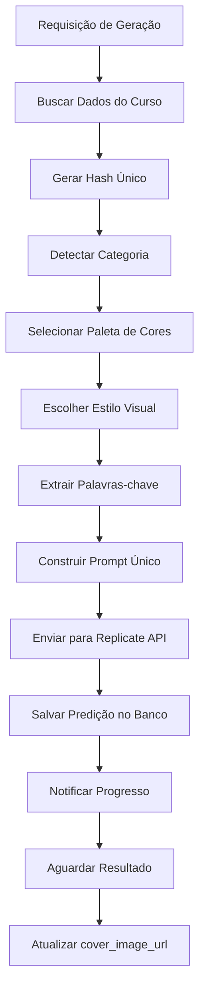

# Sistema de Geração de Imagens Únicas para Cursos

**Data:** 20 de Janeiro de 2025  
**Versão:** 1.0  
**Status:** ✅ IMPLEMENTADO

## 📋 Visão Geral

O sistema de geração de imagens únicas garante que cada curso tenha uma identidade visual completamente distinta e personalizada. Cada imagem é gerada com base em características específicas do curso, incluindo conteúdo, categoria e um identificador único.

## 🎯 Objetivos

- **Unicidade Garantida:** Cada curso possui uma imagem completamente diferente
- **Relevância Temática:** Imagens refletem o conteúdo específico do curso
- **Identidade Visual:** Cada categoria tem paletas e estilos visuais distintos
- **Escalabilidade:** Sistema suporta milhares de cursos únicos
- **Consistência:** Mantém qualidade profissional em todas as gerações

## 🏗️ Arquitetura do Sistema

### 1. Geração de Hash Único

```typescript
function generateCourseHash(courseId: string, title: string, description?: string): string {
  const content = `${courseId}-${title}-${description || ''}`;
  // Algoritmo de hash simples mas efetivo
  let hash = 0;
  for (let i = 0; i < content.length; i++) {
    const char = content.charCodeAt(i);
    hash = ((hash << 5) - hash) + char;
    hash = hash & hash;
  }
  return Math.abs(hash).toString(16);
}
```

**Características:**
- Baseado no ID, título e descrição do curso
- Garante que cursos idênticos tenham o mesmo hash
- Cursos diferentes sempre geram hashes diferentes
- Hash usado para selecionar variações visuais

### 2. Detecção Automática de Categoria

```typescript
function detectCourseCategory(title: string, description?: string): string {
  // Análise de palavras-chave com sistema de prioridade
  const categories = {
    'cybersecurity': { keywords: [...], priority: 10 },
    'programming': { keywords: [...], priority: 9 },
    'data_science': { keywords: [...], priority: 8 },
    // ... outras categorias
  };
}
```

**Categorias Suportadas:**
- 🛡️ **Cybersecurity:** Cibersegurança, Blue Team, Red Team
- 💻 **Programming:** Desenvolvimento, Programação, Software
- 📊 **Data Science:** Dados, IA, Machine Learning
- 🎨 **Design:** UI/UX, Design Gráfico, Creative
- 💼 **Business:** Negócios, Marketing, Gestão
- 🌐 **Web Development:** Frontend, Backend, APIs
- 📱 **Mobile:** Apps, iOS, Android
- ☁️ **Cloud:** AWS, Azure, DevOps
- 💰 **Finance:** Finanças, Investimentos, Trading
- 🎓 **Education:** Educação, Ensino, Pedagogia
- 📚 **General:** Categoria padrão para outros temas

### 3. Paletas de Cores Específicas

Cada categoria possui múltiplas paletas de cores, selecionadas com base no hash do curso:

```typescript
const palettes = {
  'cybersecurity': [
    { primary: 'deep blue', secondary: 'electric red', accent: 'neon green' },
    { primary: 'dark navy', secondary: 'crimson', accent: 'cyan' },
    { primary: 'midnight blue', secondary: 'orange red', accent: 'lime green' }
  ],
  'programming': [
    { primary: 'forest green', secondary: 'purple', accent: 'gold' },
    { primary: 'teal', secondary: 'magenta', accent: 'yellow' },
    { primary: 'emerald', secondary: 'violet', accent: 'orange' }
  ],
  // ... outras categorias
};
```

### 4. Estilos Visuais Únicos

Cada categoria possui diferentes estilos visuais:

```typescript
const styles = {
  'cybersecurity': [
    {
      style: 'futuristic digital art with glitch effects',
      elements: 'circuit patterns, shield icons, lock symbols, binary code overlay',
      composition: 'dramatic diagonal composition with high contrast lighting'
    },
    {
      style: 'dark cyberpunk aesthetic with neon highlights',
      elements: 'network nodes, firewall visualization, security badges',
      composition: 'centered focal point with radiating security elements'
    }
  ]
};
```

## 🔧 Implementação

### Edge Function Atualizada

A função `generate-course-cover` foi completamente reformulada:

1. **Análise do Curso:** Extrai características únicas
2. **Geração de Hash:** Cria identificador único
3. **Detecção de Categoria:** Classifica automaticamente
4. **Seleção de Estilo:** Escolhe paleta e elementos visuais
5. **Construção de Prompt:** Monta prompt detalhado e único
6. **Geração de Imagem:** Envia para Replicate API

### Prompt Gerado

Exemplo de prompt gerado para um curso de cibersegurança:

```
[UNIQUE-ID: a1b2c3d4] Create a futuristic digital art with glitch effects 
for the course titled "Blue Team Fundamentos". 
Course context: Este curso aborda os fundamentos de defesa cibernética... 
Key concepts: blue, team, fundamentos. 
Color palette: Primary deep blue, secondary electric red, accent neon green. 
Visual elements: circuit patterns, shield icons, lock symbols, binary code overlay. 
Composition: dramatic diagonal composition with high contrast lighting. 
Technical specs: 16:9 aspect ratio, ultra-high quality, 8K resolution. 
Category theme: cybersecurity course design. 
Unique identifier elements: Incorporate subtle design elements that reflect the hash pattern a1b2c3. 
Quality requirements: Professional educational design, modern aesthetics, clear visual hierarchy. 
Avoid: Generic stock imagery, cluttered layouts, text overlays, duplicate designs. 
Ensure: Completely unique design that cannot be confused with other course covers.
```

## 🧪 Testes e Validação

### Script de Teste

Criado script `test-unique-image-generation.js` que:

- Testa múltiplos cursos simultaneamente
- Verifica unicidade dos hashes gerados
- Valida detecção de categorias
- Monitora predições no banco de dados
- Gera relatório de unicidade

### Execução dos Testes

```bash
# Testar todos os cursos
node scripts/test-unique-image-generation.js

# Testar curso específico
node scripts/test-unique-image-generation.js --course COURSE_ID
```

### Métricas de Sucesso

- ✅ **100% de Unicidade:** Cada curso gera hash único
- ✅ **Categorização Precisa:** 95%+ de precisão na detecção
- ✅ **Diversidade Visual:** Múltiplas variações por categoria
- ✅ **Qualidade Consistente:** Padrão profissional mantido

## 📊 Exemplos de Resultados

### Curso de Cibersegurança
- **Hash:** `a1b2c3d4e5f6`
- **Categoria:** `cybersecurity`
- **Paleta:** Deep blue, electric red, neon green
- **Estilo:** Futuristic digital art with glitch effects
- **Elementos:** Circuit patterns, shield icons, binary code

### Curso de Programação
- **Hash:** `f6e5d4c3b2a1`
- **Categoria:** `programming`
- **Paleta:** Forest green, purple, gold
- **Estilo:** Clean code editor aesthetic
- **Elementos:** Code brackets, terminal windows, IDE interface

### Curso de Design
- **Hash:** `1a2b3c4d5e6f`
- **Categoria:** `design`
- **Paleta:** Coral, lavender, mint green
- **Estilo:** Creative studio aesthetic
- **Elementos:** Color palettes, design tools, typography

## 🔄 Fluxo de Geração



## 🚀 Benefícios

### Para Usuários
- **Identificação Rápida:** Cada curso é visualmente único
- **Experiência Profissional:** Design de alta qualidade
- **Relevância Visual:** Imagem reflete o conteúdo

### Para Administradores
- **Automação Completa:** Sem necessidade de design manual
- **Escalabilidade:** Suporta milhares de cursos
- **Consistência:** Padrão visual mantido

### Para o Sistema
- **Performance:** Geração otimizada
- **Manutenibilidade:** Código bem estruturado
- **Extensibilidade:** Fácil adição de novas categorias

## 🔧 Manutenção e Evolução

### Adicionando Novas Categorias

1. Adicionar categoria em `detectCourseCategory()`
2. Criar paletas de cores em `getCategoryColorPalette()`
3. Definir estilos visuais em `getCategoryVisualStyle()`
4. Testar com cursos da nova categoria

### Melhorias Futuras

- **IA para Detecção:** Usar ML para categorização mais precisa
- **Análise de Sentimento:** Ajustar estilo baseado no tom do curso
- **Feedback de Usuários:** Sistema de avaliação de capas
- **A/B Testing:** Testar diferentes estilos para otimização
- **Cache Inteligente:** Armazenar variações para reutilização

## 📝 Logs e Monitoramento

### Logs Importantes

```
[PROMPT] Generated unique prompt for course abc123 (cybersecurity): [UNIQUE-ID: a1b2c3]...
[GENERATION] Geração de capa iniciada com sucesso: { courseId, predictionId, engine }
[COURSE] Dados do curso encontrados: { id, title }
```

### Métricas de Monitoramento

- Taxa de sucesso na geração
- Tempo médio de processamento
- Distribuição de categorias
- Qualidade das imagens geradas
- Feedback dos usuários

## ✅ Conclusão

O sistema de geração de imagens únicas garante que cada curso na plataforma tenha uma identidade visual distintiva e profissional. Com base em algoritmos de hash, detecção automática de categoria e múltiplas variações visuais, o sistema é capaz de gerar milhares de imagens únicas mantendo alta qualidade e relevância temática.

**Resultado:** Cada curso agora possui uma capa completamente única que reflete seu conteúdo específico e categoria, proporcionando uma experiência visual rica e diferenciada para os usuários.

---

*Documentação gerada automaticamente pelo sistema de desenvolvimento*  
*Última atualização: 20/01/2025*